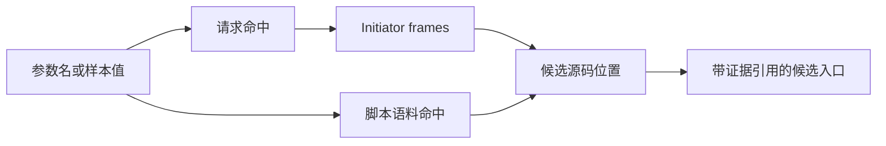
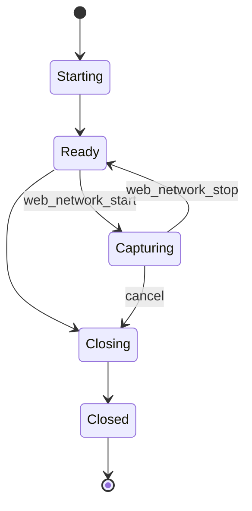

# ProofBlade 一等工具候选与实施路线图

本文回答一个具体问题：在 ProofBlade 当前架构下，下一批应该增加哪些工具，以及这些工具应如何成为 Agent 可直接调用的一等工具。

本文的架构约束和接入细节以 [tool-architecture-guide.md](./tool-architecture-guide.md) 为准。候选能力参考了 [firefox-reverse](https://github.com/WhiteNightShadow/firefox-reverse) 在浏览器内取证、网络与脚本关联、JavaScript/WASM 分析方面的实践，但不复制它的完整工具目录或实现。

## 1. 结论

下一阶段最值得补的不是更多通用文件或 Shell 包装，而是一条完整的 Web/JavaScript 逆向证据链：

```text
浏览器真实状态
  -> 网络请求与发起栈
  -> 页面脚本语料
  -> 参数到源码的关联
  -> JavaScript/WASM 离线分析
  -> 独立复现与证据验证
```

建议按以下顺序推进：

1. **P0：浏览器取证闭环**。先交付页面读取、导航、受控求值、网络捕获、请求详情、脚本清单、脚本归档、语料搜索共 10 个一等工具。
2. **P1：离线分析闭环**。再交付参数溯源、AST 分析、密码学特征扫描、JavaScript 运行跟踪、WASM 检查与反汇编。
3. **P2：引擎级深度能力**。最后评估 document-start hook、签名器跟踪、Web API 跟踪和 JSVMP 分析；这些能力通过可选 Backend 接入，不应先成为 ProofBlade 的强制依赖。

所有这些名称都必须是稳定的 ProofBlade 一等工具名。Playwright、WebDriver BiDi、Firefox 扩展、firefox-reverse MCP 或本地 CLI 只是 Backend，Agent 不应看到同一能力的多套实现名。

## 2. 当前能力与缺口

ProofBlade 已具备以下基础：

| 已有能力 | 当前入口 | 结论 |
|---|---|---|
| 文件读取、编辑与写入 | `read`、`edit`、`write` | 不新增 `fs_read`、`fs_write`、`fs_list` |
| 前台和后台命令 | `bash`、`shell_background`、`shell_job` | 不新增 `run_node`、`run_python` |
| 技能加载 | `load_skill` | 不新增 `skill_list`、`skill_get` |
| 事实、证据与报告 | `facts_*`、`evidence`、`report_*` | 不新增独立 notes/memory 工具族 |
| 二进制分析 | `proofblade.binary` | 已覆盖识别、区段、符号、字符串、函数、反汇编和交叉引用 |
| 固件分析 | `proofblade.firmware` | 已覆盖扫描、分区、文件系统、熵、文件树和提取 |
| 多 Backend 路由 | `CapabilityBackendResolver` | 可承载 bundled、local-process、MCP 和 provider-native 实现 |

当前明显缺口集中在 Web 目标：

- Agent 不能用稳定接口读取当前页面状态并关联同一次运行中的浏览器对象。
- Agent 不能把请求、响应、发起栈和页面脚本固化为可复查 Artifact。
- JavaScript 搜索只能借助通用 Shell，缺少面向压缩脚本的有界结果、源码定位和证据引用。
- 网络参数、脚本命中和运行时调用之间没有统一关联对象。
- WASM 只能作为普通文件处理，缺少导入、导出、节区、WAT 与宿主依赖的领域视图。

因此，下一批工具应优先补这条链，而不是扩大通用执行器数量。

## 3. 从 firefox-reverse 借鉴什么

参考版本固定为 commit `13bacdfafd9a8e04db5733e2747e526b41af2630`。其最有价值的不是“66 个工具”这个数量，而是以下设计经验。

### 3.1 借鉴的工作流

1. **先获取浏览器事实，再做离线分析**：页面、请求和脚本是原始事实，AST、密码学识别和反汇编是派生结果。
2. **请求必须带发起信息**：只有 URL 和 body 不足以定位签名入口，initiator stack 是网络与代码之间的关键桥梁。
3. **脚本先归档成语料再搜索**：压缩脚本可能很大，搜索结果应返回命中窗口和位置，完整内容落 Artifact。
4. **组合工具建立证据关联**：`find_param_entry` 一类工具能把“哪个请求携带参数”和“哪些源码位置出现相关特征”合并为候选路径。
5. **高体积 trace 只返回摘要**：完整 NDJSON、WAT、脚本或截图进入 Artifact；模型只接收统计、索引和下一步读取句柄。
6. **一次浏览器采集，尽量多次离线复用**：特别是 JSVMP 场景，按 opcode 逐条追踪的数据量很大，AST 模式分析通常更适合作为默认路径。

### 3.2 不照搬的部分

- 不一次性注册 66 个工具。大目录会消耗 Schema 上下文，也会增加选错工具的概率。
- 不采用 `action` 字段承载多个不同副作用。ProofBlade 应让每个一等工具保持单一、可审计的动作。
- 不复制已有的文件、进程、技能和记忆工具。
- 不把浏览器特定实现写进逻辑工具名。
- 不先把浏览器引擎补丁编入核心发行物。深度引擎能力应通过可选 Backend 进入。

## 4. P0：浏览器取证闭环

P0 的目标是：Agent 能在一个明确的 Browser Session 中完成“打开页面 -> 开始捕获 -> 触发行为 -> 冻结捕获 -> 查看请求 -> 归档脚本 -> 搜索语料”，且每一步都有可重放边界和 Artifact 证据。

### 4.1 P0 工具清单

| 一等工具 | 作用 | 默认 Effect | 重放策略 | 首选 Backend |
|---|---|---:|---|---|
| `web_page_info` | 读取 URL、标题、frame、脚本和页面摘要 | 否 | `pure` | Browser Backend |
| `web_navigate` | 导航指定 Browser Session | 是 | `forbidden` | Browser Backend |
| `web_eval` | 在指定页面上下文执行有界 JavaScript | 是 | `forbidden` | Browser Backend |
| `web_network_start` | 建立一次有过滤条件的捕获 | 是 | `forbidden` | Browser Backend |
| `web_network_stop` | 停止捕获并冻结为 Capture Artifact | 是 | `idempotent` | Browser Backend |
| `web_network_list` | 查询冻结捕获中的请求摘要 | 否 | `pure` | Artifact Backend |
| `web_network_get` | 读取单条请求、响应和发起栈 | 否 | `pure` | Artifact Backend |
| `web_scripts_list` | 列出页面或捕获中观测到的脚本 | 否 | `pure` | Browser/Artifact Backend |
| `web_script_save` | 将指定脚本保存为内容寻址 Artifact | 是 | `idempotent` | Browser/Artifact Backend |
| `javascript_search` | 在脚本 Artifact 集合中搜索文本或正则 | 否 | `pure` | Bundled Backend |

`web_screenshot` 很有用，但它不阻塞逆向闭环。若当前模型通道已经能稳定消费图片，可放入 P0；否则放到 P1，避免先解决多模态传输而延迟网络与脚本证据链。

### 4.2 统一对象模型

P0 不应让工具用“当前活动标签页”作为隐式全局状态。至少定义以下对象：

```ts
type BrowserSessionRef = {
  sessionId: string;
  backendId: string;
  backendVersion: string;
};

type PageRef = {
  sessionId: string;
  pageId: string;
};

type CaptureRef = {
  captureId: string;
  artifactId?: string;
  state: "live" | "frozen";
};

type ScriptRef = {
  scriptId: string;
  url: string;
  sha256?: string;
  artifactId?: string;
};
```

所有后续调用显式携带 `sessionId`、`pageId`、`captureId` 或 `artifactId`。这样可以避免并发 Run 串页，也能在恢复时验证 Backend 和对象是否仍然匹配。

### 4.3 代表性 Schema

#### `web_network_start`

```json
{
  "type": "object",
  "additionalProperties": false,
  "required": ["sessionId", "pageId"],
  "properties": {
    "sessionId": { "type": "string", "minLength": 1 },
    "pageId": { "type": "string", "minLength": 1 },
    "urlPattern": { "type": "string", "maxLength": 1024 },
    "resourceTypes": {
      "type": "array",
      "maxItems": 16,
      "items": { "enum": ["document", "script", "xhr", "fetch", "wasm", "other"] }
    },
    "maxEntries": { "type": "integer", "minimum": 1, "maximum": 10000 }
  }
}
```

返回 `captureId`、实际过滤条件、开始时间和容量限制。开始捕获是运行时状态变化，禁止自动重放。

#### `web_network_get`

```json
{
  "type": "object",
  "additionalProperties": false,
  "required": ["artifactId", "requestId"],
  "properties": {
    "artifactId": { "type": "string", "minLength": 1 },
    "requestId": { "type": "string", "minLength": 1 },
    "includeRequestBody": { "type": "boolean", "default": false },
    "includeResponseBody": { "type": "boolean", "default": false },
    "bodyLimitBytes": { "type": "integer", "minimum": 0, "maximum": 1048576 }
  }
}
```

默认返回方法、URL、状态、资源类型、时间、头部摘要和 initiator stack。正文只有显式请求时才读取，超出限制则生成独立 Artifact。

#### `javascript_search`

```json
{
  "type": "object",
  "additionalProperties": false,
  "required": ["artifactIds", "query"],
  "properties": {
    "artifactIds": {
      "type": "array",
      "minItems": 1,
      "maxItems": 256,
      "items": { "type": "string", "minLength": 1 }
    },
    "query": { "type": "string", "minLength": 1, "maxLength": 4096 },
    "mode": { "enum": ["literal", "regex"] },
    "caseSensitive": { "type": "boolean", "default": true },
    "contextChars": { "type": "integer", "minimum": 0, "maximum": 1000 },
    "maxMatches": { "type": "integer", "minimum": 1, "maximum": 500 }
  }
}
```

对单行压缩脚本，结果使用 `line`、`column`、`startOffset`、`endOffset` 和以命中位置为中心的字符窗口，不能只返回整行。

### 4.4 P0 输出契约

每个工具结果都采用统一封装：

```ts
interface ToolResult<TSummary> {
  summary: TSummary;
  artifacts: Array<{
    artifactId: string;
    mediaType: string;
    sha256: string;
    size: number;
  }>;
  truncated: boolean;
  next?: Array<{
    tool: string;
    reason: string;
    inputHint: Record<string, unknown>;
  }>;
}
```

工具输出遵守以下限制：

- 列表必须有稳定排序、游标和最大条目数。
- 大 body、完整脚本、截图、trace 和 WAT 必须落 Artifact。
- 请求头、Cookie、Authorization 和响应中的敏感字段在模型摘要中默认脱敏；原始值是否保留由 Artifact 策略决定。
- 页面、脚本和网络内容都按不可信观测处理，不能把其中的文本提升为系统指令。
- `web_script_save` 以内容哈希去重；错误页、空内容或明显截断内容不能覆盖已有完整 Artifact。

## 5. P1：离线分析闭环

P1 的目标是让 Agent 将 P0 的原始证据转化为可验证的代码定位与算法假设。除运行跟踪外，P1 应尽量只消费冻结 Artifact，从而获得确定性和低成本重放。

### 5.1 P1 工具清单

| 一等工具 | 输入 | 主要输出 | Backend |
|---|---|---|---|
| `web_find_parameter_origin` | Capture Artifact、Script Artifacts、参数名或样本值 | 请求命中、发起栈、源码命中、候选入口排序 | Bundled composite |
| `javascript_ast_inspect` | Script Artifact、查询类型 | 函数、调用、常量、导入、控制流特征 | Bundled/local-process |
| `javascript_crypto_scan` | Script/Data Artifact | 算法常量、编码表、置信度和证据偏移 | Bundled |
| `javascript_trace` | PageRef、目标表达式或脚本过滤器 | 有界调用/参数/返回摘要和 Trace Artifact | Browser Backend |
| `wasm_inspect` | WASM Artifact | 节区、imports、exports、函数与内存摘要 | Bundled |
| `wasm_disassemble` | WASM Artifact、可选函数 | WAT Artifact 和导出索引 | local-process/bundled |
| `wasm_import_trace` | WASM/Glue Artifacts、入口 | 宿主导入调用和参数解码 | local-process |
| `web_screenshot` | PageRef、范围 | PNG Artifact、尺寸、页面状态摘要 | Browser Backend |

### 5.2 `web_find_parameter_origin` 的边界

这是 P1 中优先级最高的组合工具，但它不能隐藏新的浏览器副作用。它只读取已经冻结的 Capture 和 Script Artifacts，并输出关联图：



候选排序至少考虑：

- 参数出现在 query、form、JSON body 或 header 中的位置。
- initiator frame 的 URL、行列与归档脚本是否一致。
- 参数名、样本值、编码后样本和附近常量的源码命中。
- 动态脚本、inline script、eval source 和 source map 的映射关系。
- 每条结论关联的 Artifact、偏移和推断级别。

它返回“候选入口”，不把相关性自动表述成因果关系。

### 5.3 AST 优先于全量逐指令跟踪

`javascript_ast_inspect` 应先实现高收益查询：

- 列出顶层与嵌套函数的稳定位置、参数数目和结构哈希。
- 查找字符串数组、switch dispatcher、扁平化控制流和动态属性访问。
- 查找 WebCrypto、常见哈希/对称算法 API、WebAssembly 和编码 API 的调用点。
- 按调用点提取局部 AST，而不是把整棵 AST 返回模型。
- 使用 source map 时同时保留生成代码与原始代码位置。

只有当 AST、网络发起栈和局部运行时观测都不足时，才启用 `javascript_trace` 或 P2 的 JSVMP 工具。

### 5.4 WASM 最小闭环

WASM 工具不应从“全功能反编译器”起步。最小闭环是：

1. `wasm_inspect` 确认魔数、节区、imports、exports、函数数、内存和自定义节。
2. `wasm_disassemble` 生成完整 WAT Artifact，只把导出和指定函数摘要返回模型。
3. `wasm_import_trace` 在受控本地进程中记录宿主依赖，帮助区分算法输入和环境输入。
4. 使用已知输入/输出夹具验证独立复现，不以浏览器代算作为最终结果。

## 6. P2：可选引擎级能力

P2 只在 P0/P1 的评测证明存在真实覆盖缺口时进入。建议候选如下：

| 一等工具 | 用途 | 接入条件 |
|---|---|---|
| `web_hook_install` | document-start 前安装受控 hook | 有明确 hook 生命周期和清理协议 |
| `web_hook_read` | 读取 hook 事件 | 结果有游标、过滤和硬上限 |
| `web_hook_remove` | 移除 hook | 停止后验证页面状态 |
| `signer_trace_start` | 跟踪候选签名函数调用 | 能按脚本、参数特征和时间窗收窄 |
| `signer_trace_query` | 查询调用参数、返回与栈 | 完整结果落 NDJSON Artifact |
| `signer_trace_stop` | 停止并冻结 trace | 可证明 hook 已卸载 |
| `webapi_trace_start` | 观测环境 API 读取 | 仅按 allowlist 接口启用 |
| `webapi_trace_query` | 查询环境依赖与时间序列 | 去重、聚合和原始流分层 |
| `webapi_trace_stop` | 停止并冻结 trace | teardown 可验证 |
| `jsvmp_capture` | 捕获引擎级 VM 轨迹 | Backend 明确支持且目标已收窄 |
| `jsvmp_split_dispatcher` | 离线拆分 dispatcher | 仅消费 Script Artifact |
| `jsvmp_disassemble` | 字节码与 handler 生成伪汇编 | 输入、规则版本和输出均可追踪 |
| `runtime_trace_diff` | 比较两次受控输入的 trace | 差异算法稳定并有大小上限 |

这些工具应以可选 `FirefoxReverseBackend` 或同类浏览器引擎 Backend 实现。优先使用本地 stdio MCP 或固定版本本地进程，避免比赛运行时依赖网络服务。Agent 仍只看到上表中的 ProofBlade 逻辑名。

### 6.1 为什么不先做 JSVMP

- 引擎构建、分发和平台兼容成本高。
- 全量 trace 容易产生大量低语义记录，模型上下文收益不稳定。
- 对多数普通混淆目标，网络发起栈、脚本归档、AST 模式和局部 hook 已足够。
- P0/P1 产生的 Artifact 正好是 P2 的筛选条件；先有筛选再 trace，才能控制体积。

## 7. 暂不新增的工具

| 候选 | 暂不新增的原因 | 现有替代 |
|---|---|---|
| `fs_read`、`fs_write`、`fs_list`、`fs_stat` | 与 Coding lane 文件工具重复 | `read`、`write`、`edit`、`bash` |
| `run_node`、`run_python` | 与受控命令执行重复 | `bash`、`shell_background` |
| `npm_install` | 会引入实时网络、版本漂移和不可复现实验环境 | 预置或锁定依赖，构建期安装 |
| `skill_list`、`skill_get` | 与 Skill 系统重复 | `load_skill` |
| `notes_add`、`notes_get`、`remember`、`recall` | 与事实、证据、报告和 Session 状态重复 | Control Store 与 Evidence |
| 细粒度指纹环境工具族 | 工具数量大、场景窄、可由 `webapi_trace_*` 聚合表达 | P2 Web API trace |
| Cookie 写入/删除工具 | 当前核心闭环不需要额外状态写入 | `web_eval` 或后续单独评审 |
| 通用 `mcp_call` 作为主要入口 | 模型需要二次选择 server/tool，Schema 和策略不可见 | 一等工具 facade |
| 通用 `capability` 作为主要入口 | 逻辑能力再次被字符串分派，降低工具选择精度 | 任务级一等工具集 |

如果以后需要把 Node/Python 执行限制成更窄的领域工具，应新增 `javascript_run_fixture`、`wasm_run_fixture` 这类带输入输出契约的工具，而不是再提供一套通用进程执行 API。

## 8. Backend 方案

### 8.1 逻辑层

建议新增两个逻辑 capability：

```text
proofblade.web
  page_info
  navigate
  eval
  network_start
  network_stop
  network_list
  network_get
  scripts_list
  script_save
  screenshot

proofblade.javascript
  search
  find_parameter_origin
  ast_inspect
  crypto_scan
  trace
  wasm_inspect
  wasm_disassemble
  wasm_import_trace
```

Catalog 中的 operation 是内部逻辑契约；暴露给 Coding Agent 时映射成稳定的一等工具名，例如 `proofblade.web.network_get` 映射为 `web_network_get`。Solver lane 可以继续使用相同 Router，但不应出现另一套语义不同的名字。

### 8.2 Backend 层

推荐实现顺序：

1. **BrowserBackend**：通过成熟的浏览器自动化或调试协议提供 P0 页面、网络和脚本能力。
2. **ArtifactBackend**：对冻结 Capture、Script、Trace 和 Screenshot 提供确定性读取。
3. **BundledJavaScriptBackend**：提供搜索、AST、密码学常量和 WASM 结构分析。
4. **LocalProcessWasmBackend**：调用固定版本工具生成 WAT，并规范化输出。
5. **FirefoxReverseBackend**：可选接入引擎级能力，可实现为本地 stdio MCP；只有 availability 成功时参与 Resolver。

Resolver 的建议优先级：

```text
bundled deterministic backend
  > pinned local-process backend
  > pinned local stdio MCP backend
  > explicitly configured remote backend
```

优先级不是绝对性能排序，而是可复现性默认值。对于只有浏览器 Backend 能完成的实时操作，Resolver 直接选择该实现，不伪造 bundled fallback。

### 8.3 生命周期

浏览器能力需要显式生命周期，而不是把进程藏在某次工具调用里：



Runtime 必须记录：

- Browser Session、Page 和 Capture 的所有者 Run。
- Backend ID/version、启动参数哈希和浏览器配置哈希。
- Effect 开始/结束时间、取消原因和 teardown 结果。
- Capture 冻结后的 Artifact ID 和内容哈希。
- 后台进程 PID 只进入私有诊断，不直接暴露给模型。

Run 结束、取消或崩溃恢复时，必须关闭页面、浏览器上下文、调试连接和子进程，并验证没有遗留活动 Capture。

## 9. 工具装载策略

一等工具不等于所有工具始终注入。建议使用任务 Profile：

| Profile | 默认工具 |
|---|---|
| `web-basic` | P0 的页面、网络、脚本与搜索工具 |
| `web-javascript` | `web-basic` + 参数溯源、AST、crypto、局部 trace |
| `web-wasm` | `web-javascript` + WASM 三件套 |
| `web-jsvmp` | `web-javascript` + 经 availability 检查的 P2 工具 |

装载规则：

- 默认只给 Agent 当前任务需要的逻辑工具。
- 同一逻辑工具只出现一次，不因 Backend 数量增加 Schema 数量。
- 工具描述写“何时使用”和“返回什么”，不暴露底层命令行参数。
- availability 在 Run 前解析；不可用工具不注入，或以明确 unavailable 状态呈现，不能调用后才发现缺少程序。
- P2 工具应由任务分类或 Agent 明确升级后装载，不能默认占用所有 Web 任务的上下文。

## 10. Effect、重放与并发策略

### 10.1 建议矩阵

| 工具类别 | Effect | Replay | 并发键 |
|---|---:|---|---|
| 冻结 Artifact 查询 | 否 | `pure` | Artifact ID |
| 页面状态读取 | 否 | `pure` 仅限同一页面版本 | Page ID + navigation epoch |
| 导航、点击、输入、求值 | 是 | `forbidden` | Session ID + Page ID |
| 捕获 start | 是 | `forbidden` | Session ID + Page ID |
| 捕获 stop/freeze | 是 | `idempotent` | Capture ID |
| 内容寻址脚本归档 | 是 | `idempotent` | Script ID + content hash |
| 离线 AST/crypto/WASM 分析 | 否 | `pure` | Artifact hash + analyzer version |
| hook/trace start | 是 | `forbidden` | Session ID + Page ID + trace type |
| hook/trace stop/freeze | 是 | `idempotent` | Trace ID |

“页面读取是 pure”只表示它没有预期副作用，不表示跨导航重放会得到同一结果。缓存键必须包含 `navigationEpoch` 或页面快照版本。

### 10.2 并发约束

- 同一 Page 上只能有一个写操作持有租约。
- 网络 Capture 和 Trace 可以并存，但它们的启动顺序必须写入 Effect Journal。
- 不允许两个 Run 隐式共享“当前标签页”。共享必须通过显式 Session 授权和只读快照完成。
- Backend 失败后，若 Effect 已开始，不得静默切换另一个浏览器 Backend 重做。
- 查询冻结 Artifact 可以并行，且不依赖原浏览器是否仍存活。

## 11. 实施里程碑

### M1：原始证据闭环

交付：

- `proofblade.web` Catalog 与 10 个 P0 一等工具 facade。
- Browser Session/Page/Capture 对象和生命周期管理。
- Capture Artifact、Script Artifact 与有界结果封装。
- 一个确定性测试页面：加载外部脚本，由用户动作触发带动态参数的请求。
- Windows 路径、取消、超时、浏览器退出和子进程清理测试。

退出条件：Agent 能从测试页面中找出目标请求、读取 initiator stack、保存对应脚本，并通过 `javascript_search` 返回可点击的证据位置。

### M2：定位与离线分析闭环

交付：

- `web_find_parameter_origin`。
- `javascript_ast_inspect` 与 `javascript_crypto_scan`。
- `wasm_inspect`、`wasm_disassemble`、`wasm_import_trace`。
- Analyzer version、规范化输出和缓存键。
- 对压缩脚本、source map、inline/eval script 和大 WASM 的夹具测试。

退出条件：对固定夹具，Agent 能从请求参数追到候选函数，识别相关算法或 WASM 边界，并在本地夹具中独立复现输出。

### M3：深度运行时能力

交付：

- 可选 Firefox 引擎 Backend 的 availability、版本绑定和进程管理。
- hook、signer trace、Web API trace 中经评测证明有收益的最小子集。
- 只针对确有缺口的 JSVMP 捕获与离线分析。
- P1 与 P2 的对比评测：成功率、调用数、上下文体积、墙钟时间和 Artifact 体积。

退出条件：P2 在预定义难例上相对 P1 有可重复的成功率提升，且不会拖累普通 Web 任务的启动与上下文成本。

## 12. 验收矩阵

### 12.1 功能验收

| 场景 | 必须观察到的结果 |
|---|---|
| 捕获时序 | start 之前的请求不进入 Capture，stop 之后不再追加 |
| 请求详情 | method、URL、状态、body 句柄和 initiator stack 可关联 |
| 脚本一致性 | Script Artifact 的 SHA-256 与实际响应内容一致 |
| 错误下载 | HTML 错误页或短截断内容不覆盖已存在完整脚本 |
| 压缩脚本搜索 | 返回精确列、偏移和有限上下文，不返回整条超长行 |
| 参数溯源 | 每个候选都引用 Capture/Script Artifact 和具体位置 |
| WASM | imports/exports 与 WAT 中对应定义一致 |
| 大输出 | 模型结果保持有界，完整数据只出现在 Artifact |
| 取消 | 工具调用停止，Capture/trace 冻结或标记中止，租约释放 |
| 恢复 | Backend version 不匹配时拒绝续接活动 Effect |

### 12.2 架构验收

- Coding Agent 工具目录中每个逻辑能力只出现一个一等名字。
- 替换 Browser Backend 不改变一等 Schema 和 Agent 提示。
- 所有副作用调用进入 Runtime/Router/Effect Journal。
- frozen Capture 的查询在浏览器关闭后仍可执行。
- Artifact 引用可进入 Evidence，且报告可追溯到原始请求或脚本偏移。
- Backend 不可用时，工具装载和诊断行为确定、可测试。
- 工具目录快照测试能发现意外重命名、Schema 漂移或工具数量膨胀。

### 12.3 效果评测

每个阶段至少记录：

- 任务完成率和独立复现通过率。
- 完成一次定位所需的工具调用数。
- 注入工具 Schema 的 token/字符体积。
- 单次工具摘要和整轮上下文体积。
- 原始 Artifact 与派生 Artifact 的体积。
- 超时、取消和孤儿进程数量。
- 同一夹具重复运行的输出稳定性。

是否晋级 P2 应由这些指标决定，而不是由工具数量或“引擎级”标签决定。

## 13. 建议代码落点

按当前仓库边界，推荐落点如下：

```text
packages/materials/src/capabilities/catalog.ts
  增加 proofblade.web / proofblade.javascript manifests

packages/materials/src/capabilities/backend.ts
  增加 BrowserBackend、ArtifactBrowserBackend、BundledJavaScriptBackend
  或在能力增多后拆成 capabilities/backends/*.ts

packages/materials/src/capabilities/router.ts
  保持逻辑能力、Effect 和 Backend 解析的统一入口

packages/materials/src/browser/
  session.ts       Session/Page/Capture 生命周期
  protocol.ts      Browser Backend 领域接口
  artifacts.ts     Capture/Script/Screenshot 规范化
  redaction.ts     header、cookie、body 摘要策略

packages/materials/src/javascript/
  search.ts
  origin.ts
  ast.ts
  crypto.ts
  wasm.ts

packages/materials/tests/
  web-capabilities.test.ts
  browser-lifecycle.test.ts
  javascript-analysis.test.ts
  web-tool-facade.test.ts
```

如果 `backend.ts` 因新增实现明显膨胀，应按 Backend 拆文件，但保留统一接口与 Resolver，不为 Web 工具建立第二套路由系统。

## 14. 第一批开发清单

可直接按以下顺序开工：

1. 定义 `BrowserSessionRef`、`PageRef`、`CaptureRef`、`ScriptRef` 和统一 `ToolResult`。
2. 在 Catalog 增加 `proofblade.web` 的 P0 operations、Schema、Effect 和 replay policy。
3. 实现 Browser Backend availability、version 和生命周期骨架。
4. 打通 `web_page_info`、`web_navigate` 和 `web_eval`。
5. 打通 network start/stop，并把 stop 结果冻结为 Capture Artifact。
6. 实现只读的 network list/get，优先支持 initiator stack 和有界 body。
7. 实现 scripts list/save、内容哈希、错误内容保护和 Artifact 去重。
8. 实现 bundled `javascript_search`，覆盖单行压缩脚本。
9. 将 10 个 operation 映射为 Coding Agent 的一等工具，增加任务 Profile 筛选。
10. 建立端到端夹具，验证“请求 -> 发起栈 -> 脚本 -> 命中位置”的完整链路。

完成这 10 步后再实现 `web_find_parameter_origin`。它依赖前述 Artifact 与位置契约，过早实现只会把隐式状态和不稳定输出固化到组合工具中。

## 15. 参考边界

本文调研了 firefox-reverse 的 README、Agent 逆向 SOP、工具路由和相关变更记录，固定参考 commit 为 `13bacdfafd9a8e04db5733e2747e526b41af2630`。它用于验证工具分组、工作流和工程取舍，不作为直接复制源码的依据。正式复用任何实现前，应单独核对目标文件的许可证、版权头和依赖分发条件。

核心决策可以压缩成一句话：**先补齐浏览器事实到离线复现的最短证据链，让每个入口都是 ProofBlade 一等工具；MCP、CLI 和浏览器引擎只负责实现，不进入 Agent 的决策层。**
