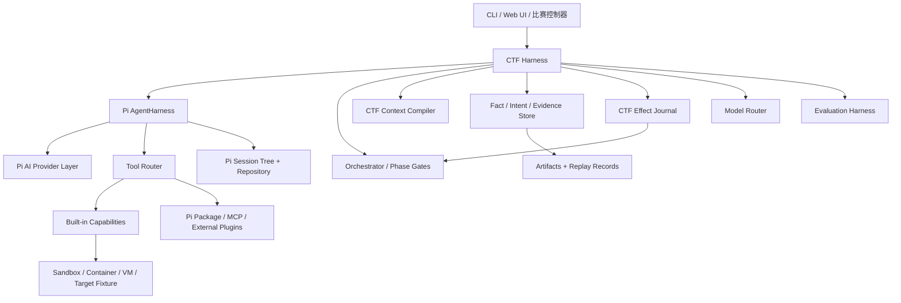

# 面向西湖论剑的 Pi CTF Agent / Harness 设计基线

> 研究时间：2026-08-04  |  研究对象：Pi Agent Harness、Pi Package 生态、Reasonix、OpenClacky、Firefox-Reverse、Tsec Hackathon 第二季前三名  |  文档状态：v0.3 实施基线

## 0. 先给结论

你的方向应当是：**使用 Pi AI + Pi 当前已实现的 `AgentHarness` 作为通用运行基座，在它之上自建 CTF Control Plane，再从 Reasonix、OpenClacky、Firefox-Reverse 和往届前三名吸收经过源码或答辩材料验证的机制。**

这里的关键修正是：Pi 在当前版本已经包含单 lane `AgentHarness`、Session tree、JSONL/SQLite repository、显式 compaction、Skill/Prompt Template、工具 hooks 和运行事件。不要重复实现这些通用能力；但 Pi 的多 lane、在途 operation 恢复、durable queue、自动压缩和完整 effects journal 仍处于设计/规划阶段，CTF 项目需要通过适配层补齐，请勿把 `harness-v2.md` 当作已经发布的 API。

不建议一开始 fork Pi，也不建议把多个项目的功能拼成一个“万能 Agent”。真正决定比赛表现的不是工具数量，而是以下六件事：

1. 上下文在长任务中保持可用，模型不会因为压缩而忘掉已确认事实。
2. 每个工具调用产生可验证证据，结论可以回放、复现和审计。
3. 流程有阶段、状态和停止条件，模型走弯路时能自动换路线。
4. 多模型按角色分工，而不是每个模型都拥有全部工具并互相重复劳动。
5. Harness 能够恢复、重试、暂停、继续和评测，开发者可以定位失败发生在哪一层。
6. 目标执行环境可重置、可隔离、可复现，模型上下文和控制平面不得成为越权或提示注入的通道。

本文件把 Agent 拆成五个职责边界：

| 层 | 负责什么 | 建议实现 |
|---|---|---|
| LLM 适配层 | Provider、流式输出、模型参数、工具调用协议 | Pi AI |
| 通用 Agent Harness | 消息循环、Session tree、JSONL/SQLite、compaction、Skill、工具生命周期、steer/follow-up | Pi `AgentHarness` |
| CTF Control Plane | 题目状态、阶段门、Fact/Intent、预算、调度、在途恢复、结束判定 | 自建 TypeScript 层 |
| CTF 能力层 | 静态分析、动态执行、网络/浏览器、模糊测试、报告生成 | 自建工具 + MCP/插件 |
| 隔离与评测层 | 容器/VM、目标重置、网络策略、隐藏评分器、回放和指标 | 自建 Fixture/Eval 基础设施 |

最终目标不是“会聊天的逆向助手”，而是一个可以在本地隔离环境中完成下列闭环的系统：

```text
题目接入 → 目标建模 → 计划 → 侦察 → 假设 → 实验/利用 → 验证 → 证据归档 → 报告
                         ↑                    ↓
                         └────── 失败反馈 / 路线切换 ──────┘
```

---

## 1. 任务边界与设计目标

### 1.1 目标用户和比赛形态

你面对的是开发型 CTF：Agent 需要在给定题目、源码、二进制、容器、网页或服务的环境中，连续使用工具完成分析和验证。比赛评分通常同时看：

- 是否拿到 flag 或完成题目要求；
- 是否能发现并验证漏洞；
- 是否能在限定时间和 Token 预算内完成；
- 是否能稳定处理异常、超时、错误输出和模型波动；
- 是否能留下可解释的过程和可复现的产物。

因此，Harness 的优化目标应按以下优先级排序：

1. **任务完成率**：在固定题目集上的通过率。
2. **有效推进率**：产生新证据的工具调用占比。
3. **恢复能力**：进程重启、模型超时、上下文压缩后继续完成的比例。
4. **成本和延迟**：缓存命中、输入输出 Token、每题平均耗时。
5. **可观察性**：能否解释“为什么走这条路线、为什么停、哪一步失败”。

### 1.2 第一版的范围

第一版建议集中在三类题型：

- Web / API：请求分析、源码定位、参数构造、服务端行为验证；
- Reverse：ELF/PE/字节码/混淆逻辑的静态和动态分析；
- Pwn / binary：本地运行、崩溃复现、输入变异、调试器和脚本验证。

Crypto、Misc、移动端和硬件分析可以通过同一套能力协议逐步加入，不需要在第一版把所有工具注册到模型上下文。

### 1.3 明确的非目标

以下内容放入后续阶段：

- 一开始就做几十个 Agent 的自由协作；
- 一开始就做向量数据库和复杂知识图谱；
- 把每个工具的原始输出全部塞回上下文；
- 为了“看起来智能”而加入没有评测依据的自动反思；
- 直接改造 Pi 核心循环，导致上游升级和问题定位成本上升。

### 1.4 学习顺序：按失败边界学，不按框架列表学

你已经掌握基础工具调用，下一步不要继续横向收集框架 API。建议每一阶段都做一个可运行练习：

| 阶段 | 要学会的核心概念 | 最小练习 | 通过标准 |
|---|---|---|---|
| 1. Pi Harness | AgentHarness、Session、hook、event、tool pair | 一次 read → tool result → follow-up | Session 重开后消息一致 |
| 2. Durable state | command/event/reducer/projection、幂等 | 在任意 event 前后杀进程 | replay hash 一致 |
| 3. Context | token budget、cache prefix、artifact、compaction | 小窗口长任务 | 压缩后不重复已证实动作 |
| 4. Workflow | phase gate、Fact/Hypothesis/Intent | 两条竞争路线的合成题 | 能否决死路并切换路线 |
| 5. Effects | sandbox、lease、background job、reconcile | 工具完成后崩溃 | 无重复提交和孤儿进程 |
| 6. Multi-model | 独立 Session、handoff、router、verifier | Planner + Executor 对照 | 指标优于单 Agent baseline |
| 7. Evaluation | fixture、hidden scorer、replay、ablation | 20 题多次运行 | 改动收益可重复 |

阅读开源项目时也沿这条线：先找到它解决的失败模式，再读对应测试和状态结构，最后才看 prompt。只摘录 prompt 往往学不到真正的 Harness 机制。

---

## 2. 参考项目分别能教你什么

### 2.1 Pi：通用 Runtime 与正在演进的 AgentHarness

Pi 的仓库按职责拆为 `pi-ai`、`pi-agent-core`、`pi-coding-agent` 和 `pi-tui`。截至本文锁定的源码快照，`@earendil-works/pi-agent-core` 为 `0.83.0`。需要把 Pi 的能力分成“当前可依赖”与“设计目标”两列看待。

当前代码已经覆盖：

- `AgentMessage` 与 LLM 消息的转换；
- `transformContext`，用于每次请求前裁剪、注入和重排上下文；
- 流式事件：`agent_start`、`turn_start`、`message_*`、`tool_execution_*`、`turn_end`、`agent_end`；
- 并行或串行工具执行；
- `beforeToolCall` / `afterToolCall`；
- `steer` 和 `followUp` 队列；
- `shouldStopAfterTurn`；
- 动态模型、思考等级、Provider API Key 和 session id。
- 单 lane `AgentHarness`，提供 `prompt`、`skill`、`promptFromTemplate`、`steer`、`followUp`、`nextTurn`、`compact` 和 tree navigation；
- `Session`/`SessionTreeEntry`，支持 message、model/tool change、compaction、branch summary、custom entry 和 durable leaf；
- in-memory、JSONL repository，以及独立包提供的 SQLite backend；
- `context`、`tool_call`、`tool_result`、provider request/response、compaction 等 hook/event；
- `read/write/edit/bash` 等基于 `ExecutionEnv` 的通用工具和输出截断辅助函数。

这些能力应当直接复用。Pi 已经把“模型请求如何变成可观察事件、如何进入 Session tree、如何显式压缩和切换工具集合”做成了可用接口。你的 CTF 代码围绕 `AgentHarness` 和 Session 适配，不再直接从低层 `Agent` 起步。

Pi 仓库中的 `harness-v2.md` 进一步设计了 lane、operation/run/turn/step、provisioned id、effects boundary、durable queue、reducer 恢复和 telemetry。**这些设计不应视为当前实现**：当前源码仍是单 harness operation，auto-compaction 未接入 `AgentHarness`，在途 provider/tool 恢复、多 lane API 和 durable queue 仍在规划中。

因此边界是：

- **直接采用**：当前 `AgentHarness`、Session tree、repository、hooks、显式 compaction、Skill/Prompt 和基础工具；
- **适配封装**：CTF Context Compiler、工具结果归档、题目状态和 Pi custom entry/projector；
- **自行实现**：题目/Intent 调度、资源 lease、外部 effect journal、恢复判定、Verifier、提交状态与评测；
- **跟踪上游**：Pi 多 lane 和 durable operation 落地后，通过 feature flag 替换本地相同职责，不把 CTF 业务写入 Pi fork。

Pi 的边界仍然清楚：它不会替你定义 CTF 阶段、证据模型、题目状态、实验回放、多模型角色和比赛评测。Pi 是通用 Harness，不是 CTF 方法论。

#### 2.1.1 Pi Package 生态：直接复用的第六类参考对象

Pi 还提供 Package 分发和加载机制。一个 Pi Package 可以同时携带四类资源：

| 资源 | 运行方式 | 对 CTF Agent 的主要价值 |
|---|---|---|
| Extension | TypeScript 模块，订阅生命周期事件、注册工具/命令/UI、拦截调用 | MCP、浏览器、输出处理、权限策略、开发面板 |
| Skill | 按需加载的 `SKILL.md`、脚本、参考资料和资产 | Web/Reverse/Pwn SOP、工具用法、检查清单 |
| Prompt Template | 显式调用的任务模板 | 固定 Intake、Verify、Report 输入格式 |
| Theme | TUI 主题 | 只影响交互体验，不进入核心运行语义 |

`pi.dev/packages` 是 Pi 官方维护的 Package Catalog，目录收录带 `pi-package` 标记、发布到 npm 的资源。这里需要区分两件事：**官方提供目录和安装协议**，与**包本身由官方维护**。目录中大量包来自社区作者；目录展示、下载量和 MIT 许可证只作为初筛信息，进入比赛依赖前仍需源码审计、版本锁定和回归评测。Pi 官方文档也明确说明 Extension 以宿主进程权限执行，Skill 可以携带可执行脚本，因此包审核属于 Harness 供应链的一部分。

截至 2026-08-04，下面这些目录条目与本项目最相关。版本只表示本次调研快照，实际仓库通过精确版本或 commit 锁定：

| Package | 快照版本 | 提供什么 | 本项目建议 | 职责边界 |
|---|---:|---|---|---|
| [`pi-mcp-adapter`](https://pi.dev/packages/pi-mcp-adapter) | `2.19.0` | 单一代理工具、按需发现 MCP schema、懒启动 server、元数据缓存 | **P0 候选**；优先用它验证 MCP 能力接入 | Control Plane 仍负责 effect、预算、lease 和证据归档 |
| [`pi-subagents`](https://pi.dev/packages/pi-subagents) | `0.40.0` | 独立子会话、chain/parallel/background、模型与工具配置、TUI | **P1 原型/对照组**；快速验证 Planner/Executor 和 Handoff | 权威 Intent 调度、完成判定和恢复仍归 CTF Control Plane |
| [`@hypabolic/pi-hypa`](https://pi.dev/packages/%40hypabolic/pi-hypa) | `0.1.12` | Shell 输出确定性压缩、上下文感知文件工具、可恢复证据 | **P1 A/B 候选**；对比自研 snip/prune/artifact pipeline | 只选一种输出重写链，避免多插件重复裁剪同一结果 |
| [`context-mode`](https://pi.dev/packages/context-mode) | `1.0.169` | 沙箱代码执行、FTS5 知识库、意图检索和跨 Harness 上下文处理 | **P2 研究项**；用小窗口 fixture 复测其 98% 节省声明 | 与 Context Compiler、artifact store、memory 的职责重叠较大 |
| [`pi-agent-browser-native`](https://pi.dev/packages/pi-agent-browser-native) | `0.2.76` | 以原生工具驱动真实浏览器 session | **P0 Web 能力候选** | 浏览器重置、域名策略、下载归档和凭据隔离由 Sandbox adapter 管理 |
| [`pi-hermes-memory`](https://pi.dev/packages/pi-hermes-memory) | `0.9.2` | SQLite FTS5、Session 检索、记忆合并、secret scanning | **P2 检索候选**；先用于历史搜索和提示 | Fact/Evidence 的权威来源仍是 CTF Control Store |
| [`@ayulab/pi-rewind`](https://pi.dev/packages/%40ayulab/pi-rewind) | `0.4.6` | 交互式 checkpoint 导航 | **开发体验候选** | `/rewind` 与进程崩溃恢复、Effect reconciliation 分开建模 |
| [`@quintinshaw/pi-dynamic-workflows`](https://pi.dev/packages/%40quintinshaw/pi-dynamic-workflows) | `3.5.0` | 大规模 fan-out、模型路由、成本统计、resume、worktree 隔离 | **P2 benchmark**；用于比较多 Worker 收益 | 第一版保持 1-2 个 Worker，防止并行浪费掩盖基础错误 |
| [`pi-harness-runtime`](https://pi.dev/packages/pi-harness-runtime) | `0.10.16` | Codex 风格 usage 与自动化 Harness，目录标记为 Beta | **源码研究项** | 当前版本变化频繁，先提取测试和指标设计 |

这里最值得优先验证的并非“安装更多包”，而是三条现成能力链：

1. `pi-mcp-adapter` 验证固定代理工具 + 按需 schema 是否降低上下文和缓存抖动；
2. `pi-agent-browser-native` 验证浏览器能力是否能稳定纳入 Effect/Artifact 协议；
3. `pi-subagents` 作为多 Agent baseline，与自研 `多个 AgentHarness + Control Plane` 做配对评测。

`@hypabolic/pi-hypa`、`context-mode` 和本项目 Context Compiler 都会接触上下文或工具结果。同一个 Run 只启用一条主裁剪链，否则出现重复截断、证据 hash 对不上、Token 指标归因混乱等问题。Memory 类 Package 只承担检索和候选提示，Reducer 仍根据 Evidence 创建 Fact。

#### 2.1.2 Package 与嵌入式 AgentHarness 的接入差异

`pi install` 面向 `pi-coding-agent` 应用层；通过 `@earendil-works/pi-agent-core` 直接创建 `AgentHarness` 时，CLI 的 Package 自动发现和 ExtensionAPI 不会自动出现在自定义进程里。项目需要先选清运行模式：

| 模式 | Package 接入 | 优点 | 适用阶段 |
|---|---|---|---|
| Pi CLI Worker | Control Plane 启动 Pi CLI，项目级 `.pi/settings.json` 锁定 Package | 插件开箱即用、TUI 和命令齐全、验证速度快 | 学习、原型、Package A/B |
| Embedded AgentHarness | `runtime-pi` 直接使用 core；把选中的 Package 能力改接为 tool/capability adapter，或作为独立 MCP/sidecar | 状态、恢复、测试和服务化边界更清晰 | 比赛主线和长期维护 |
| Hybrid | CLI Worker 做交互式调试；嵌入式 Worker 跑评测和比赛；两者共享 Tool/Handoff/Evidence contract | 兼顾迭代速度与确定性 | 推荐过渡路线 |

建议前两周使用 Hybrid：先用 `pi -e npm:PACKAGE@VERSION` 临时加载候选包，在固定 fixture 上记录 tool schema、context delta、artifact、Token、耗时和成功率；达到门槛后，把依赖精确写入项目级配置。进入比赛运行时，Package 版本、npm tarball integrity、来源 commit、启用的 resource filter 和配置 hash 都写入 RunManifest。

每个候选 Package 经过同一条晋级流程：

1. 阅读 manifest、入口文件、安装脚本、依赖树和网络行为；
2. 使用精确版本或 git commit，在临时进程中加载；
3. 快照新增 tool/schema、hook 顺序、system prompt 和 context 增量；
4. 注入超时、进程退出、畸形输出、目标重置和重复执行故障；
5. 与无 Package baseline 在同一 fixture、模型、种子和预算下重复评测；
6. 达到成功率/成本/恢复门槛后进入默认配置，否则留在实验 profile；
7. 每次升级重新跑 supply-chain audit、adapter contract test 和 live 子集。

因此，“用 Pi 自己的组件”应扩展为三层：Pi core、Pi coding-agent 的 Package/Extension/Skill 机制、Catalog 中经项目评测晋级的社区能力包。其他开源 Agent 继续用于学习控制平面与算法机制，而不是替代这套可插拔底座。

### 2.2 Reasonix：缓存稳定、配置驱动和双模型

Reasonix 的主线经验有七条：

1. **Cache-first loop**：系统提示、工具契约和稳定环境摘要保持在前缀，减少长会话的重复成本。
2. **Minimal tool surface**：初始工具面保持小，通过 Skill、MCP 或能力连接按需扩展。
3. **Config / plugin driven**：Provider 和 Tool 通过注册表及配置解析，新增兼容模型或外部工具优先改配置。
4. **Executor + Planner**：规划模型和执行模型使用独立、缓存稳定的会话，规划结果以结构化任务交接给执行器。
5. **Tool contract**：工具名、只读属性、描述、Schema 由同一条规范路径产生，并用测试保护。
6. **先确定性降噪，再调用摘要模型**：在 60% 左右先把陈旧大工具结果做 head/tail snip，在约 80% 做 archive + prune，仍超预算才生成 LLM summary；错误结果和最近 tail 保留。
7. **稳定能力代理**：通过固定 schema 的 `use_capability`/connector 发现并调用按需 MCP，避免能力清单变化破坏 Provider 可见前缀。

对你的启发是：

- 把“稳定前缀”和“动态工作上下文”分离；
- 让工具目录成为能力索引，不要在第一轮把所有工具定义塞给模型；
- 多模型协作先做一主一辅，先证明收益再增加角色；
- 工具契约和任务契约都要可测试。
- Planner 路由优先使用 Harness 根据任务元数据做的确定性策略，不再额外调用一个分类模型；
- Planner/Executor 保持独立会话，交接是结构化计划，不在同一消息历史里来回切模型；
- `plan-only`、等待确认等边界采用 fail-closed，普通自动执行场景才允许 Planner 故障后回落到 Executor；
- 工具 schema 的名称、顺序、描述和 canonical JSON 都进入快照测试，因为任意变化都可能影响缓存和模型选工具行为。

### 2.3 OpenClacky：压缩、技能演化和成本控制

OpenClacky 的实现把消息压缩、工具执行、成本统计、Skill 管理、时间机器、记忆更新和 Hook 拆成模块。值得吸收的机制如下：

- **Insert-then-Compress**：在现有对话中插入压缩指令，让压缩请求复用 system prompt 和工具前缀的缓存；
- **压缩结果带主题和归档锚点**：摘要不是一段孤立文本，而是带 topics、当前归档文件和历史 chunk 索引；
- **Idle-time compression**：空闲时预压缩，减少下一次用户输入的冷启动成本；
- **Skill 自演化**：从重复工作流中提炼 Skill，并用评测验证后再纳入；
- **成本追踪和 fake tool call 检测**：把 Token、缓存和伪工具调用纳入运行时指标。
- **MCP 虚拟 Skill**：主上下文只保留一个固定 `mcp_call` 工具和每个服务的一行能力描述，完整 schema 仅在需要时进入子任务上下文；
- **Time Machine 的树与文件快照分离**：消息分支保留全部历史，文件状态用 task snapshot 恢复，两者不应只回退一个。

适配到 CTF 时，压缩摘要应额外保存：已确认事实、已否决假设、目标入口、已执行命令、产物路径、下一步、阻塞点和证据 ID。只写“目前进展顺利”这类摘要没有恢复价值。Skill 自动生成只能写入候选区，经过基线对照、污染检查和人工晋级后才能成为比赛默认 Skill；否则一次偶然成功会固化成长期错误策略。

### 2.4 Firefox-Reverse：领域 Agent 产品化

Firefox-Reverse 最适合学习“如何把一个专业工作流做成 Agent”。它的关键设计包括：

- 64 个工具按页面、网络、代码、JSVMP、WASM、文件、环境和记忆分组；
- 全自动与 AI 辅助两种模式；
- worker 模型负责重复执行，director 模型负责阶段判断；
- 父进程常驻，UI 重载不丢任务；
- 任务账本（已确认事实和已否决路线）持续注入；
- 阶段 checkpoint、进度文件和跨会话 SQLite 记忆；
- 同参数同结果重复调用熔断；
- 无进展预算、连续错误检测、截断重试和工具参数修复；
- 先做“黑盒可用”，再做“白盒纯算”的双阶段目标。

这些机制比“再添加十个工具”更有参考价值。CTF 版本可以把黑盒/白盒替换成：先完成最小可验证利用，再追求根因、稳定脚本和高质量报告。

### 2.5 Tsec-Hackathon 第二季前三名：比赛环境下的架构分歧与共同规律

这一节只研究第二季最终前三名：第 1 名 `ai小分队 / BreachWeave`、第 2 名 `Sniper`、第 3 名 `Bytex / Cairn`。三者的路线互有冲突，恰好能回答“多 Agent 应当预定义角色，还是让 Agent 自组织”这个核心问题。

#### 第一名：BreachWeave 的控制平面

BreachWeave 是最接近“以 Pi 为内核，自建比赛 Harness”的参考实现。它在 Bun monorepo 中把 CLI/Web UI、`@tch/core` 和 Pi SDK 分层；挑战管理器使用 `createAgentSession`，并维护题目、Solver、Idea、Memory、提交和统计等状态。

它的核心架构是 `Manager / Solver / Observer`：

- `Manager` 是控制平面，维护题目优先级、运行中 Solver、资源上限和调度节拍；
- `Solver` 面向单条路线执行实际工具调用，可并行探索；
- `Observer` 旁路观察近期轨迹，专注发现偏移、过早停止、状态混杂和低效重复；
- `Idea` 保存探索方向，状态为 `pending/testing/verified/failed/skipped`；
- `Memory` 保存 `fact/evidence/failure/note/hint`，并带来源和引用；
- 任务完成依据题目状态和系统约束判断，而不是只听模型的完成宣告。

这个项目的赛后描述还包含 RTK Rewrite 三层压缩、Ralph-Loop 系统状态约束结束判定，以及最多 7 个模型并行竞争。源码层面还能看到它对 Solver 数、活跃题目数、陈旧任务阈值、每个 Solver 的上下文条目数和 handoff 字数都做了硬上限。

**应该吸收的部分**：

1. 用控制平面管理并发、预算、题目状态和结束条件；
2. 把“探索方向”和“已证实事实”分离；
3. Observer 保持旁路，只提交诊断、纠偏建议和状态摘要；
4. 交接使用有长度上限的结构化摘要；
5. 给每类状态加显式上限，避免多 Agent 把上下文和成本一起推高。

**对当前项目的落地判断**：第一版保留 `Manager + Solver`，并把 Observer 先实现为确定性 Harness 检查器，而非第三个持续调用模型。这样可以先拿到重复调用、无进展、预算和完成条件的诊断能力，再用评测决定是否增加 LLM Observer。

#### 第二名：Sniper 的自适应中间件与知识闭环

Sniper 的公开资源是第二季答辩 PPT，主题为“Self-Evolving Kill Chain: Agent 自适应进化与实战”。PPT 展示的核心是 `DeepAgent`：主 Agent 保留完整任务上下文，子 Agent 执行子任务；失败后依据环境反馈做分析、规划、执行和再规划。其关键取舍是先用确定性管道完成可预测动作，再把不确定性留给模型推理。

PPT 中的八层 Agent 中间件可归纳为：

1. 观测：调用链、Token、耗时、成本和结果；
2. 上下文摘要：保留任务状态、目标和关键结果；
3. 工具结果降噪：把大输出转为可引用的高信号内容；
4. 畸形工具调用修复：处理模型输出的协议和参数问题；
5. 能力发现：维持小型核心工具面，按需检索工具/Skill；
6. 任务规划：维护结构化计划和阶段状态；
7. Skill 系统：按场景注入专业流程和工具知识；
8. 容错：将错误分类、恢复、重试和策略调整串成闭环。

它还区分四类知识：Skill、RAG 知识、任务 Memory、经验自蒸馏。PPT 中的经验自蒸馏强调把成功路径和失败原因转成可检索条目，让下一次任务能基于历史策略变化继续推理。答辩展示还包含工具调用观测、报告生成和运行日志。

**应该吸收的部分**：

1. Harness 中间件链优先于“大 prompt 万能化”；
2. 工具结果归一化、错误修复、上下文预算和计划状态必须先于多模型扩张；
3. 知识层按“运行时事实、长期经验、领域流程、检索资料”分层；
4. 错误后的下一步由“错误签名 + 当前证据 + 任务状态”生成，而不是只追加一句继续尝试；
5. 可观测性属于运行时基础设施，直接进入第一版。

**对当前项目的落地判断**：将八层压缩成第一版的五个中间件：`observe → normalize → context → plan → recover`。Skill、检索、经验蒸馏作为后续能力插件接入；这能先获得 Sniper 路线的关键收益，同时保持开发面可控。

#### 第三名：Cairn 的黑板状态空间搜索

Cairn 的立场与 BreachWeave 相反：它尽量少预定义业务角色和工作流，把问题表达成从 `origin` 到 `goal` 的状态空间搜索。其黑板中只有三类一等对象：

- `Fact`：已确认的客观发现；
- `Intent`：从已有事实出发、尚待探索的方向；
- `Hint`：人类或外部系统注入的即时判断。

Worker 执行 OODA 循环，读取图后生成 Intent、认领一个 Intent 并探索，最后写回 Fact。Worker 之间只通过黑板协作，不直接互聊。Cairn 还把协议真相源和执行面拆开：Server 管理 Fact/Intent/Hint 和 lease；Dispatcher 决定调度、健康检查、容器/本地进程、超时和协议写回；Worker 只执行结构化任务并返回 JSON。它提供 Pi Worker adapter，说明 Pi 可以充当图搜索系统中的 Worker 后端。

README 报告该项目在第二季完成 54/54 题并获第 3 名；这一成绩应视为项目方公开的赛果陈述。更值得借鉴的是它的协议约束：任务被收敛为 `bootstrap`、`reason`、`explore` 三类，输出经过 JSON schema 校验后才写入图；`reason` 用项目级 lease 保证单一决策源，`explore` 通过 intent claim 支持并行；超时或解析失败进入同一 session 的 `conclude` 收尾，尽力把已获得事实固化下来。

**应该吸收的部分**：

1. 证据账本升级为 `Fact / Intent / Hint` 图，而不是一条没有关系的记忆列表；
2. 让 Dispatcher 成为结构化状态唯一写入者，模型负责提议，Harness 负责验证和提交；
3. 以 `reason` 产生探索意图，以 `explore` 消耗一个意图并回写事实；
4. 用 lease、heartbeat、超时和 conclude 管理并发任务；
5. 每次模型输出都通过任务级 schema 校验，协议错误不会污染全局事实。

**对当前项目的落地判断**：从 Milestone 2 开始，将现有 Evidence Ledger 设计为可演进的 Fact/Intent/Hint 数据模型。第一版保持显式 Phase；多 Solver 出现后，探索任务从 Intent 图动态生成。这样先保留 CTF 流程的可控性，再获得 Cairn 的弹性搜索能力。

#### 三者冲突的统一答案

三种路线并非只能三选一。适合 Pi CTF Agent 的结构是：

```text
固定控制面：Manager / Harness / Observer(确定性) / Verifier
                         ↓ 生成、校验、调度
弹性执行面：Intent Board → 多个通用 Solver Worker → Fact Board
                         ↑                  ↓
                    Hint / Evidence / Artifact
```

- BreachWeave 解决控制、预算、结束判定和工程分层；
- Sniper 解决长会话中的中间件、知识和错误闭环；
- Cairn 解决大规模并行探索时的工作分配和共享事实。

因此，当前推荐路线是“**控制面固定、执行面按 Intent 弹性扩缩**”。它比完全固定角色更适合未知题型，也比完全自组织更容易在开发初期调试和评测。

### 2.6 经验取舍矩阵

| 机制 | 直接采用 | 改造后采用 | 暂不采用 | 原因 |
|---|---:|---:|---:|---|
| Pi `AgentHarness` + Session tree | ✓ |  |  | 当前源码已实现，作为通用运行基座 |
| Pi JSONL/SQLite repository | ✓ |  |  | 会话消息、配置变化、compaction 和分支持久化 |
| Pi compaction / hooks / tools |  | ✓ |  | 用 hook 接入 CTF ledger 和 artifact 规则 |
| Pi Package manifest / filter / project scope | ✓ |  |  | 直接作为开发期能力分发和可复现实验配置 |
| `pi-mcp-adapter` / browser Package |  | ✓ |  | 复用能力接入，外层补 Effect、Sandbox、Artifact 契约 |
| `pi-subagents` / workflow Package |  | ✓ |  | 先做外部 baseline，权威调度仍由 Control Plane 提交 |
| Pi `harness-v2` 多 lane/在途恢复 |  |  | ✓ | 当前是设计目标，跟踪上游，不按未发布 API 编码 |
| Reasonix 缓存稳定前缀 |  | ✓ |  | 需要适配 CTF 动态证据层 |
| Reasonix 配置/插件注册表 | ✓ |  |  | 便于迭代和比赛环境部署 |
| Reasonix Planner/Executor |  | ✓ |  | 先做双模型，角色数量受评测驱动 |
| Reasonix snip → prune → summary | ✓ |  |  | 低成本确定性降噪先于摘要调用 |
| 稳定 `use_capability` 代理 |  | ✓ |  | 保持工具 schema 稳定，CTF 能力按需发现 |
| OpenClacky Insert-then-Compress |  | ✓ |  | 摘要格式要加入证据和路线状态 |
| OpenClacky Skill 演化 |  | ✓ |  | 需要离线评测和人工确认门 |
| Firefox-Reverse 阶段 SOP | ✓ |  |  | CTF 任务天然适合阶段门 |
| Firefox-Reverse 账本/熔断 | ✓ |  |  | 直接降低绕圈和重复探索 |
| BreachWeave Manager/Solver/Observer |  | ✓ |  | 固定控制面；Observer 先以确定性检查器实现 |
| BreachWeave Idea/Memory | ✓ |  |  | 对应项目的 Intent/Fact/Evidence 账本 |
| Sniper 中间件链 |  | ✓ |  | 第一版收敛为 observe/normalize/context/plan/recover |
| Sniper 四类知识 |  | ✓ |  | 先接入 Memory 与 Skill，检索和经验蒸馏由评测驱动 |
| Cairn Fact/Intent/Hint 黑板 |  | ✓ |  | Milestone 2 建模，Milestone 4 用于多 Worker 调度 |
| Cairn Dispatcher + 协议契约 | ✓ |  |  | Harness 是唯一状态提交者，模型结果先校验 |
| 64 个工具的规模 |  |  | ✓ | 工具数量不是第一阶段目标 |
| 全部模型自由互聊 |  |  | ✓ | 容易重复劳动和污染上下文 |
| 直接 fork Pi 核心 |  |  | ✓ | 先用 `AgentHarness`/Session/hook 适配验证需求 |

---

## 3. 推荐总体架构

### 3.1 分层图



这张图里存在两个持久化事实域，须分开管理：

- **Pi Session tree** 保存 Provider 可恢复的消息、compaction、分支和模型/工具配置变化；
- **CTF Control Store** 保存 task、phase、Fact、Intent、Hypothesis、Evidence、Artifact、Lease、Effect 和提交状态。

二者通过稳定 ID 关联，不做双向隐式同步。Pi Session 是“模型看过什么”，CTF Store 是“系统确认什么”。两者冲突时，完成判定只信 CTF Store。

### 3.2 目录建议

```text
pi-ctf-agent/
├─ apps/
│  ├─ cli/                         # 交互入口、run/resume/replay/eval
│  └─ dashboard/                   # 后续可选
├─ packages/
│  ├─ runtime/                     # Pi Agent 的装配和事件适配
│  ├─ control-plane/               # task/phase、Intent 调度、恢复、队列
│  ├─ context/                     # CTF 分层上下文编译、检索、预算
│  ├─ models/                      # provider 配置和角色路由
│  ├─ tools/                       # 工具契约、注册表、权限、输出规范
│  ├─ capabilities/                # web/reverse/pwn/static/dynamic 等能力
│  ├─ knowledge/                   # Fact/Intent/Hypothesis/Evidence/Artifact
│  ├─ effects/                     # 外部副作用 journal、lease、恢复策略
│  ├─ sandbox/                     # fixture 生命周期、网络和进程隔离
│  ├─ skills/                      # 题型 SOP 和可评测 Skill
│  └─ evals/                       # golden tasks、回放器、指标
├─ fixtures/                       # 本地合成题目和测试目标
├─ runs/                           # 每题 Control Store、Pi Session 和 artifact
├─ docs/
│  ├─ architecture.md
│  ├─ tool-contract.md
│  ├─ task-contract.md
│  └─ eval-protocol.md
└─ package.json
```

### 3.3 “谁拥有状态”的规则

这是实现时最重要的边界：

- Pi `Session`：消息、compaction、branch、model/tool change 和 provider 视图的历史；
- CTF Control Store：task、phase、budget、queue、lease、effect、submission 和运行状态的唯一来源；
- Context Compiler：从两个 Store 与 artifact 索引编译本轮上下文，不直接拥有事实；
- Knowledge Store：Fact/Intent/Hypothesis/Evidence/Artifact 及其关系的唯一来源；
- Tool Router：工具声明、输入校验和执行生命周期，不负责决定任务是否完成；
- Orchestrator：阶段、调度和停止条件，只通过命令接口触发 effect，不直接操作目标；
- Sandbox Manager：目标生命周期、进程/容器/网络资源的唯一所有者；
- Verifier：提交复现证据和完成建议，不得直接把 Run 改成 `DONE`。

这样可以避免“摘要写进消息后，原始事实失去出处”以及“UI 状态和运行状态不一致”。

### 3.4 依赖方向与替换边界

依赖必须单向：

```text
apps → control-plane → domain ports
                    ↘ runtime-pi adapter
                    ↘ storage adapters
                    ↘ sandbox adapters
                    ↘ capability adapters
```

领域层不得 import Pi 的具体类型。定义自己的 `AgentLanePort`、`SessionProjectionPort`、`CapabilityPort` 和 `EffectStorePort`，再由 `runtime-pi` 转接。这样 Pi 上游实现 durable multi-lane 后，替换的是 adapter，不是 Fact/Intent/评测模型。

建议第一天就写 ADR：

- `ADR-001`: Pi `AgentHarness` 作为通用基座；
- `ADR-002`: Pi Session 与 CTF Control Store 分离；
- `ADR-003`: Context 是编译产物；
- `ADR-004`: 模型只能提议状态，Reducer 才能提交状态；
- `ADR-005`: 外部副作用必须经过 Effect Journal。

---

## 4. Harness 核心设计

### 4.1 Run、Turn、Step、Effect 四级模型

建议使用四级运行单位：

| 单位 | 含义 | 持久化重点 |
|---|---|---|
| Run | 一次题目任务，从接入到结束 | task contract、开始/结束、模式、预算 |
| Turn | 一次模型请求及其工具批次 | assistant 消息、工具调用、usage |
| Step | 阶段内的一个可重试动作 | attempt、输入、输出、状态 |
| Effect | 外部副作用，例如启动容器、写文件、发送请求 | effect id、幂等键、结果 |

每个 Run 具有 `run_id`，每个 Turn/Step/Effect 都具有稳定 ID。恢复逻辑依据“已存在的记录”判断是否重放，避免依赖内存变量。

### 4.2 Durable Event Log

第一版可以使用 JSONL，后续切 SQLite。事件字段建议如下：

```ts
type HarnessEvent = {
  schemaVersion: 1;
  id: string;
  runId: string;
  lane: "main" | "planner" | "executor" | "verifier";
  seq: number;
  ts: string;
  correlationId: string;
  causationId?: string;
  actor: "user" | "orchestrator" | "model" | "tool" | "sandbox";
  type:
    | "run_started" | "phase_started" | "phase_finished"
    | "turn_started" | "assistant_message" | "effect_proposed"
    | "effect_started" | "effect_finished" | "effect_reconciled"
    | "fact_added" | "intent_changed" | "evidence_added" | "checkpoint_created"
    | "model_usage" | "run_paused" | "run_finished" | "run_failed";
  payload?: Record<string, unknown>;
  payloadRef?: { artifactId: string; sha256: string };
};
```

规则：

- 每个 Run 使用单写者分配单调递增 `seq`；并行 lane 通过 inbox 提交命令，不直接抢写；
- 先以事务写事件，再由纯 Reducer 更新派生状态；SQLite 中事件与 snapshot 更新同一事务，JSONL 原型则以 event 为准重建 snapshot；
- 所有事件可按 `runId + seq` 重放，Reducer 必须是确定性的，禁止在 Reducer 内读时钟、文件和网络；
- Tool result 大文本落盘，事件只存 `artifact_ref`、摘要和 hash；
- 事件写入失败时，不向模型或 UI 宣告 effect 已提交；恢复时进入 reconciliation；
- 并行工具的完成事件按真实完成顺序记录，但消息视图按 assistant 原始调用顺序重建。
- 每个事件带 `correlationId` 关联一个 Step，带 `causationId` 指向触发它的上一事件；
- Schema 升级通过显式 upcaster 完成，不直接修改历史 JSONL。

Control Store 至少维护三个读模型：

1. `run_snapshot`：当前 phase、budget、status、active lanes、最后 seq；
2. `knowledge_projection`：Fact/Intent/Hypothesis/Evidence/Artifact 的当前状态；
3. `operations_projection`：未完成 Effect、lease、后台 job 和待提交结果。

CLI 查询读 projection；`replay` 从零重放后计算 hash，并与 projection hash 对比。两者不一致就是 Harness bug。

### 4.3 恢复、重试和幂等

每个外部动作定义 `replay_policy`：

| 类型 | 例子 | 重启后的动作 |
|---|---|---|
| pure | 读取文件、静态解析 | 直接重跑 |
| idempotent | 写入固定路径、创建已命名目录 | 检查 effect id 后补齐 |
| resumable | 长时间 fuzz、调试会话 | 读取 checkpoint 后继续 |
| reconcile | 启动进程、提交答案、创建容器 | 先查询外部状态，再决定补记或重试 |
| manual | 需要人工选择的实验 | 恢复为待确认状态 |
| forbidden-replay | 不可重复的外部动作 | 标记 outcome unknown，停止自动推进 |

Provider 重试采用指数退避，最多次数由模型和阶段配置决定。上下文溢出单独计数：同一用户输入最多触发一次压缩恢复，防止“压缩—重试—再次溢出”的循环。

Effect 的最小提交协议：

```text
1. validate command
2. append effect_proposed(effect_id, idempotency_key, replay_policy)
3. append effect_started
4. execute through Sandbox/Capability adapter
5. persist stdout/stderr/result artifact and hash
6. append effect_finished(outcome, artifact_ref)
7. Reducer derives Fact/Evidence candidates
```

进程可能在步骤 4 和 6 之间崩溃，所以仅有 `effect_started` 时应先进入 `unknown`，再按 reconciliation 结果决定是否重跑：

- 读文件、静态解析等 pure effect 可重跑；
- 命名容器、后台 job 通过外部 ID 查询；
- 提交 flag 通过 submission id 或题目平台状态查询；
- 目标变更类实验查询不到时标记 `unknown`，先重置 fixture 再开始新实验。

幂等键建议为：

```text
sha256(run_id + tool_contract_version + normalized_args + fixture_generation)
```

`fixture_generation` 每次目标重置递增，避免把旧环境中的缓存结果错当成新环境结果。

### 4.4 Lane 与并发

领域上推荐四个逻辑 lane：

- `main`：题目负责人和最终交接；
- `planner`：路线设计、假设排序、阶段切换建议；
- `executor`：工具密集型操作；
- `verifier`：独立复现、反例检查和报告校验。

Pi 当前 `AgentHarness` 是单 lane，所以第一版的“lane”实现为**多个独立 `AgentHarness` 实例 + CTF Control Store 调度**，每个实例拥有独立 Pi Session，请勿把 `harness-v2.md` 的 `createLane()` 当作现成接口。第一版只启动 `main + executor`，并把 verifier 做成同一个 Run 内的阶段。只有评测显示独立验证能明显提高成功率时，再启用独立 verifier。

同一 lane 内一次只允许一个 active operation；不同 lane 可并行。写文件、目标进程和共享工作区使用 lease 或队列串行化。

Lease 最少包含：`resource_key`、`owner_lane`、`acquired_at`、`expires_at`、`heartbeat_at`、`generation`。资源键使用明确命名，例如 `workspace:TASK`、`target:TASK`、`process:debugger`、`intent:I-004`。过期 lease 只能由 Orchestrator 回收；Worker 不得自行修改归属。

### 4.5 Run 状态机与合法转移

Run 状态不要只用 `open/closed`：

```text
CREATED → READY → RUNNING ⇄ PAUSED
                    ↓         ↓
                 VERIFYING → SUCCEEDED
                    ↓
          FAILED / EXHAUSTED / CANCELLED / NEED_HUMAN
```

合法转移由表驱动，所有 terminal state 不可逆。`BLOCKED` 容易混淆“临时依赖”和“任务结束”，建议拆成：

- `PAUSED`：可自动或人工恢复；
- `NEED_HUMAN`：缺少只由用户提供的信息；
- `EXHAUSTED`：时间、Token、成本或实验预算耗尽；
- `FAILED`：出现确定性、不可恢复错误；
- `CANCELLED`：外部取消。

模型文本中的“完成”“拿到了”仅产生 `completion_proposed` 命令。Reducer 只有在 Verifier gate 和 submission/reproduction gate 都通过时才写 `SUCCEEDED`。

---

## 5. 上下文管理设计

### 5.1 六层上下文模型

不要把“上下文”当作一条消息数组。建议拆成六层：

| 层 | 内容 | 生命周期 | 进入模型方式 |
|---|---|---|---|
| L0 稳定指令 | Agent 角色、工具规则、输出协议 | 版本级 | system 前缀 |
| L1 题目契约 | 目标、输入、成功标准、限制、工作目录 | Run | system/user 固定段 |
| L2 当前阶段 | 当前阶段目标、允许工具、完成门槛 | Phase | 结构化注入 |
| L3 账本 | 已确认事实、已否决假设、风险、证据索引 | 动态 | 每轮小段注入 |
| L4 最近轨迹 | 最近若干轮消息和工具结果 | Turn | 正常消息 |
| L5 归档检索 | 历史摘要、原始输出、旧实验 | 按需 | 工具读取或引用 |

核心规则：L0/L1 尽量稳定，L2/L3 使用短结构化文本，L4 只保留最近窗口，L5 通过 artifact/evidence 工具按需读取。在 Pi `AgentHarness` 中通过 `context` hook 返回编译后的 messages；原始 Pi Session 保持 append-only，Context Compiler 不回写裁剪后的视图。

Context Compiler 的输入和输出都应可快照测试：

```ts
type ContextBuildInput = {
  runId: string;
  lane: string;
  phase: Phase;
  modelProfile: ModelProfile;
  piMessages: AgentMessage[];
  task: TaskContract;
  knowledgeVersion: number;
  activeIntentIds: string[];
};

type ContextBuildOutput = {
  messages: AgentMessage[];
  manifest: ContextManifest;
  estimatedTokens: number;
  dropped: Array<{ kind: string; id?: string; reason: string }>;
};
```

`ContextManifest` 记录本轮实际注入的 Fact/Evidence/Artifact ID、各层 token、compiler version 和 hash。调试 `context_amnesia` 时，先看 manifest，而不是猜模型为什么忘了。

### 5.2 Task Contract

每个任务开头生成一个不可随意修改的任务契约：

```json
{
  "schema_version": 1,
  "task_id": "TASK",
  "mode": "ctf_solve|vulnerability_discovery",
  "target_kind": "unknown|web|reverse|pwn|crypto|misc|mixed",
  "target": "HOST_OR_LOCAL_FIXTURE",
  "objective": "拿到 flag 或证明漏洞并生成复现脚本",
  "inputs": [
    {"path": "input/challenge.bin", "sha256": "...", "read_only": true}
  ],
  "success_criteria": [
    "至少一条独立证据证明假设成立",
    "产物可在同一 fixture 中重复执行",
    "报告包含入口、根因、影响和复现步骤"
  ],
  "verification": {
    "kind": "platform_submission|hidden_scorer|reproduction",
    "command": "./score TASK",
    "required_reproductions": 2
  },
  "scope": {
    "allowed_hosts": ["TARGET"],
    "allowed_ports": [80],
    "external_network": false,
    "allowed_workspace": "./runs/TASK"
  },
  "pause_policy": [
    "scope_change", "credential_required", "irreversible_external_effect"
  ],
  "constraints": {
    "deadline_ms": 1800000,
    "max_cost_usd": 2.0,
    "max_tool_calls": 120,
    "max_submissions": 5
  }
}
```

Task Contract 本身是 immutable value object。phase、next action、remaining budget 保持在 Run Snapshot 中。输入 hash、目标、scope、success criteria、pause policy 和总预算仅能由 Host 命令创建新版本；模型只能提交澄清或修改建议。每个 effect 记录实际使用的 `task_contract_version`。

### 5.3 压缩策略

采用“确定性降噪 + Pi compaction hook + 证据归档”的组合，不要一到阈值就花一次模型摘要：

1. 约 55%-60%：预警，只做统计，保持历史不变；
2. 约 60%-70%：把陈旧大工具结果归档，并用 head/tail、退出码、关键命中和 artifact ref 替代；
3. 约 75%-80%：prune 已归档的陈旧结果，保留完整 tool call/result 配对、错误结果和最近 tail；
4. prune 后仍超过预算：调用 Pi `compact()`，通过 `session_before_compact` hook 提供 CTF 专用摘要或补充指令；
5. 达到 90% 或 Provider 报 overflow：执行一次强制恢复，临时拉回最近一组完整消息以给压缩请求留空间；
6. 同一个 operation 只允许一次 overflow recovery；第二次进入 `context_overflow` 失败分类；
7. 摘要生成失败时，根据 Control Store 生成机械 checkpoint，保证恢复路径存在。

百分比是初始值，不是常量真理。实际阈值按 `context_window - max_output_tokens - provider_margin` 计算，并通过不同模型的回归数据调整。

压缩前后必须保持以下不变量：

- task objective、success criteria、phase 和 active Intent 不变；
- CONFIRMED/REJECTED 状态及其 Evidence 引用数量不减少；
- 最近一组 assistant tool call 与全部 tool result 配对完整；
- 所有被移除的大结果都有可读 artifact ref 和 hash；
- 未完成后台 job、lease、Effect 和待验证结论仍可见；
- checkpoint 不把 Hypothesis 改写成 Fact，也不提升 confidence；
- Context Compiler 对同一输入和版本生成相同 manifest hash。

摘要必须使用固定结构：

```markdown
## Task
- task_id: TASK
- phase: reconnaissance
- objective: ...

## Confirmed facts
- F-001: ... (evidence E-003)

## Rejected hypotheses
- H-002: ... (reason/evidence E-006)

## Artifacts
- A-001: path=artifacts/request.json, sha256=...

## Actions already completed
- command/tool: ...
- result: ...

## Next actions
1. ...

## Blockers / human input
- none
```

### 5.4 预算和裁剪

每轮请求前计算：

```text
available = context_window - output_budget - safety_margin
cost = system + tools + task + ledger + recent_messages + tool_results
```

`safety_margin` 不宜只留固定 1-2k Token，需要覆盖 Provider wrapper、reasoning 输出差异和 schema 估算误差。第一版取 `max(4096, context_window * 0.05)`，再以真实 usage 校准估算器。

裁剪顺序：

1. 去除 UI 元数据、重复环境描述和已失效 Hint；
2. 把已归档的工具原文替换为 evidence/artifact 引用；
3. 合并相同错误签名和重复观察，但保留计数与首末时间；
4. 按 active Intent、phase 和 recency 选择相关 Fact，不按字符串长度粗暴截断；
5. 保留任务锚点、阶段目标、未完成 Effect、账本和最近完整工具对；
6. 最后才触发 LLM 摘要。

工具输出建议按三档控制：

- 小结果：直接回灌；
- 中结果：回灌摘要 + 前后片段 + 文件引用；
- 大结果：落盘并只回灌统计、关键行和 hash。

### 5.5 账本与记忆分层

借鉴 Reasonix 的“standing instructions / background memory”区分，同时增加 CTF 专用账本：

| 数据 | 示例 | 可信度 | 存储 |
|---|---|---|---|
| Standing instruction | 必须先记录证据再下结论 | 高 | 项目规则文件 |
| Task fact | 服务端返回固定长度 token | 中高 | evidence ledger |
| Rejected hypothesis | 参数不是时间戳，样本对照已排除 | 中高 | hypothesis ledger |
| Episode history | 昨晚一次超时输出 | 低 | session history |
| Reusable skill | ELF 栈溢出初筛流程 | 需评测 | Skill 文件 |

“已否决假设”非常重要。它能阻止模型在压缩后重新搜索同一条死路，也是 Firefox-Reverse 账本设计在 CTF 场景中的直接落点。

### 5.6 上下文中的信任边界

CTF 目标返回的网页、源码注释、文件名、命令输出和远程工具描述全部是**不可信数据**。进入上下文时必须带来源标签，应与系统指令分隔，禁止拼成同一段无边界文本：

```text
<untrusted-observation source="tool:web_fetch" artifact="A-018">
...
</untrusted-observation>
```

Harness 规则：

- 目标内容只能形成 Observation 或 Hypothesis，不得修改 Task Contract、权限、Tool Registry 和停止条件；
- 从目标内容解析出的“请调用某工具”等文本不进入控制命令通道；
- Tool/MCP 描述属于已安装代码的信任域，但动态返回的资源仍是不可信数据；
- secret、API key、比赛凭据在 event、artifact、provider payload 和日志四处统一脱敏；
- ContextManifest 记录每段外部内容的来源与 hash，报告引用原始 artifact，不引用模型转述。

---

## 6. CTF 工作流和阶段门

### 6.1 推荐状态机

```text
INTAKE
  ↓
MODEL_TARGET
  ↓
PLAN
  ↓
RECON
  ↓
HYPOTHESIS
  ↓
EXPERIMENT
  ↓
REPRODUCE
  ↓
REPORT
  ↓
DONE / BLOCKED / NEED_HUMAN
```

每个阶段都定义：目标、输入、允许能力、输出 schema、完成条件和失败转移。

这不是严格单向流水线，而是“**外层 Phase、内层 Intent 图**”：Phase 控制权限、预算和输出要求；Intent 图允许在 RECON/HYPOTHESIS/EXPERIMENT 之间局部回跳。发现目标类型判断错误时允许回到 `MODEL_TARGET`，验证失败时回到 `HYPOTHESIS`，但每次回跳必须写原因、消耗预算并更新已否决路线。

### 6.2 阶段定义

| 阶段 | 目标 | 最小输出 | 进入下一阶段的门 |
|---|---|---|---|
| Intake | 解析题目和资源 | task contract | 目标、预算、工作区明确 |
| Model target | 建立目标模型 | 入口、边界、依赖 | 至少一个可操作入口 |
| Plan | 排序假设和实验 | 计划 DAG | 每个动作有预期证据 |
| Recon | 获取初始事实 | 资产/符号/请求清单 | 关键入口或候选路径 |
| Hypothesis | 形成可证伪假设 | H-ID + 证据 | 至少一个低成本实验 |
| Experiment | 执行实验 | E-ID、输入、结果 | 成功或明确排除 |
| Reproduce | 稳定复现 | 脚本、命令、输出 | 连续两次复现一致 |
| Report | 组织结论 | report.json + Markdown | 证据链闭合 |

阶段门不是额外的“提示词装饰”，而是 Harness 在 `phase_finished` 前检查的结构化条件。模型说“完成了”不等于阶段完成。

不同题型复用阶段协议，不共享一份巨型 SOP：

| 题型 | Model target 的关键对象 | 典型低成本首检 | Reproduce 的最低门 |
|---|---|---|---|
| Web/API | 路由、参数、身份、信任边界、数据流 | 源码/请求/响应差分 | 重置服务后脚本独立成功 |
| Reverse | 格式、架构、入口、校验路径、关键常量 | strings/imports/symbols/CFG | 干净输入上得到相同输出或 flag |
| Pwn | 保护、输入面、崩溃点、控制能力 | checksec + 最小 crash | 干净进程连续成功，记录偏移和环境 |
| Crypto | 原语、随机数、密钥/nonce 生命周期、样本关系 | 已知向量/统计/差分 | 独立脚本对隐藏样本成立 |
| Misc | 数据格式、编码层、元数据、隐写/协议 | file/magic/metadata | 从原始附件一键生成结果 |

### 6.3 全自动和辅助模式

参考 Firefox-Reverse，提供两种模式：

- **Auto**：目标清晰时，Harness 自动推进；只在登录态、验证码、题目歧义和预算决策处暂停；
- **Assist**：每个阶段结束时提交阶段摘要、证据、风险和 2-3 个路线选项，由用户或 director 选择。

开发阶段优先使用 Assist。它能暴露阶段划分、工具契约和摘要质量问题；稳定后再把相同流程切到 Auto。

### 6.4 无进展和绕圈护栏

建议实现四个运行时护栏：

1. `repeat_breaker`：同一工具、同一参数、同一结果连续超过阈值时短路后续执行；
2. `no_progress_budget`：连续若干次调用没有新增 evidence、artifact 或状态变化时，注入路线切换要求；
3. `failure_signature`：相同错误签名重复出现时，要求更改参数、工具或假设；
4. `phase_deadline`：阶段超过时间预算时进入总结/换路线，而不是无限续跑。

再增加三个 CTF 特有护栏：

5. `intent_novelty`：新 Intent 与现有路线的目标、方法和预期证据高度相同则合并，不创建平行重复任务；
6. `environment_drift`：fixture generation、二进制 hash、服务版本或关键配置变化时，旧实验降级为 stale；
7. `claim_without_evidence`：模型宣称 flag/漏洞/根因但没有 EvidenceRef 时，自动转为待验证 Hypothesis。

护栏默认软提示，只有纯机械重复才硬阻断。这样既减少死循环，也保留模型在复杂题目中的探索空间。

### 6.5 Intent 选择算法

不要让 Manager 只凭一段自然语言“感觉哪个方向更好”。第一版使用可解释评分：

```text
score(intent) =
  2.0 * expected_information_gain
+ 1.5 * success_probability
+ 1.2 * evidence_relevance
+ 0.8 * novelty
- 1.0 * normalized_cost
- 1.2 * environment_risk
- 1.5 * duplicate_similarity
- 0.8 * dependency_depth
```

每项归一化到 `[0,1]`，权重只作为初值。硬过滤先于排序：依赖未满足、lease 被占用、预算不足、已被同代环境证据否决的 Intent 不进入候选集。

调度流程：

1. `reason` 根据新增 Fact/Hint/失败签名生成或更新 Intent；
2. Reducer 做 schema 校验、去重、依赖和预算过滤；
3. Scheduler 按 score 与资源类型选择 Intent；
4. Worker 原子 claim，获得带 generation 的 lease；
5. Worker 结束时提交 Observation/Artifact 和 conclusion proposal；
6. Reducer 校验后更新 Fact/Hypothesis/Intent，触发下一次 `reason`。

固定节拍调用 Planner 会浪费成本。触发 Planner 的条件应是：新增高价值 Fact、open Intent 归零、连续失败达到阈值、阶段预算过半、Hint 到达或 Verifier 推翻结论。

---

## 7. 多模型调用设计

### 7.1 角色定义

| 角色 | 任务 | 工具权限 | 输出 |
|---|---|---|---|
| Planner | 拆题、排序假设、选择实验 | 只读 + 账本读取 | Plan DAG |
| Executor | 执行具体动作、产出文件和证据 | 读写/运行能力 | StepResult |
| Verifier | 独立复现、找反例、检查报告 | 只读 + 受控运行 | VerificationResult |
| Synthesizer | 汇总最终结论和报告 | 证据读取 | Report |

第一版建议 `Planner + Executor`。Verifier 可以在同一个 Executor Run 内作为“验证阶段”实现。多模型不是越多越强，角色越多，交接、缓存和上下文成本越高。

### 7.2 交接协议

模型之间不传整段聊天，传结构化交接：

```ts
type Handoff = {
  schemaVersion: 1;
  handoffId: string;
  taskId: string;
  sourceLane: string;
  targetLane: string;
  knowledgeVersion: number;
  phase: string;
  objective: string;
  confirmedFacts: EvidenceRef[];
  hypotheses: Hypothesis[];
  rejected: RejectedHypothesis[];
  nextActions: Action[];
  budget: { remainingMs: number; remainingTokens: number };
  requiredArtifacts: string[];
  prohibitedRepeats: string[];
  expectedOutputSchema: string;
};
```

Planner 只负责“下一步做什么以及为什么”，Executor 负责“执行并留下什么证据”。Executor 的原始工具轨迹不回灌给 Planner，除非形成了新的事实、失败签名或路线建议。接收方先检查 `knowledgeVersion`；版本落后时重新生成 handoff，避免 Worker 基于旧图重复执行。

Handoff 不是事实复制。`confirmedFacts` 只传 ID、claim 和最小摘要，接收方需要细节时调用 `read_evidence`/`read_artifact`。所有 lane 读取同一个 Knowledge Store，但各自拥有独立 Pi Session，保持 Provider 前缀缓存和错误隔离。

### 7.3 路由策略

| 场景 | 主模型 | 辅助模型 | 说明 |
|---|---|---|---|
| 快速侦察 | 低延迟/低成本 | 无 | 高并发、结构化输出 |
| 复杂逆向推理 | 强推理模型 | Executor | 强模型做路线，便宜模型做工具活 |
| 长时间 fuzz | Executor 模型 | Planner 定期检查 | 让模型不占据等待时间 |
| 关键结论 | Verifier/强模型 | 原模型 | 独立复现优先 |
| 报告生成 | Synthesizer | 证据检索模型 | 只允许引用已有 evidence |

模型路由由配置决定，避免业务代码中出现 `if model === ...`。每个模型配置包含：context window、max output、tool calling、JSON/schema 稳定性、并发上限、reasoning level、价格、超时、重试上限、数据驻留要求和适用阶段。

```ts
type ModelProfile = {
  id: string;
  provider: string;
  model: string;
  contextWindow: number;
  maxOutputTokens: number;
  supportsTools: boolean;
  supportsParallelTools: boolean;
  supportsStructuredOutput: boolean;
  maxConcurrency: number;
  timeoutMs: number;
  maxRetries: number;
  costClass: "low" | "medium" | "high";
  strengths: Array<"planning" | "tool_use" | "reverse" | "code" | "verification" | "vision">;
};
```

第一版路由用确定性规则，不加 router LLM：

```text
if task is short and low-risk                 → executor-only
if phase requires cross-artifact reasoning    → planner then executor
if same failure signature repeats >= 2        → planner replan
if claim can finish the challenge             → independent verifier
if context/tool schema exceeds model profile  → larger-context fallback
if provider is degraded                       → same-role fallback model
```

同角色 fallback 可以继续消费相同 Handoff；跨角色 fallback 禁止静默发生。Planner 故障时：

- 普通自动执行且任务契约允许时，可将 pristine task + 当前 Fact 交给 Executor；
- `plan-only`、阶段审批和关键验证场景保持暂停，不把 Planner 故障解释为“直接执行”；
- Verifier 故障不等于验证通过，Run 保持 `VERIFYING` 或换备用 verifier。

### 7.4 并行策略

可并行：独立文件读取、符号扫描、多个输入样本分析、只读网络枚举。应串行：共享文件写入、同一目标进程控制、会改变环境的实验、同一假设的连续变异。Pi 的 `executionMode` 和 Harness 的资源 lease 共同决定实际并发。

### 7.5 多模型竞争与汇合

“多模型同时想答案”只用于高不确定、高价值节点，不应成为默认模式。推荐两种受控模式：

- **Diverse propose**：2-3 个 Planner 只读同一知识快照，各自产生 Intent，Reducer 去重后统一评分；
- **Independent verify**：Verifier 不读取 Solver 的推理过程，只读取 Task Contract、候选产物和最小 Evidence，减少确认偏差。

汇合时不要让另一个 LLM自由总结所有回答。使用确定性 merge：

1. schema 校验；
2. Fact/Evidence ID 对齐；
3. Intent 相似度去重；
4. 冲突项标成 competing hypotheses；
5. 依据预期信息增益选择下一实验。

当一个分支得到可验证结果时，取消仍未开始的同类 Intent；已运行且成本低的分支可进入 conclude，把新增 Fact 写回后停止。记录 `parallel_waste_tokens` 和 `duplicate_intent_rate`，否则并发容易只提高账单。

### 7.6 多模型上线门槛

每增加一个角色都要通过同一套对照：至少 20 个固定 challenge、每题 3 次运行，报告成功率、95% 置信区间、p50/p95 时间、成本和重复调用率。只有满足下列之一才保留：

- 成功率有稳定提升，成本增长在预设范围；
- 成功率不变但 p95 延迟或人工介入明显下降；
- 成本不变但证据完整率、恢复率或验证通过率明显上升。

若只让报告看起来更“聪明”，却没有改变这些指标，就删除该角色。

---

## 8. Tool / Capability 设计

### 8.1 初始工具面

第一版保持 12-16 个稳定工具，复杂能力通过能力路由按需暴露：

```text
read_file        write_file        list_files        search_code
run_command      run_background    read_job_output   stop_job
inspect_target   run_experiment    collect_evidence  read_artifact
propose_intent   propose_fact      report_status     ask_human
```

题型能力通过 `invoke_capability` 或 Skill 进入：

```text
invoke_capability({
  "capability": "elf_triage",
  "operation": "symbols",
  "args": {...}
})
```

这样可以保持 Provider 可见的工具 schema 稳定，同时让能力数量增长不拖垮上下文。`propose_*` 只提交命令，经 Reducer 校验后才能更新 Knowledge Store；模型不直接写 Fact、Evidence 和 Run status。

`invoke_capability` 的 schema 固定，但能力目录必须可发现。每个 capability 提供短 manifest：

```ts
type CapabilityManifest = {
  id: string;
  version: string;
  description: string;
  targetKinds: TargetKind[];
  operations: string[];
  readOnly: boolean;
  requiredBinaries: string[];
  resourceKeys: string[];
  estimatedCost: "low" | "medium" | "high";
};
```

主上下文只放 manifest 的一行摘要；完整 operation schema 在 `inspect_capability` 或专用 Worker 的第一条任务消息里加载。动态增加 MCP/能力时保持核心工具名和排序稳定。

### 8.2 Tool Contract

每个工具契约至少包含：

```ts
type ToolContract = {
  name: string;
  version: string;
  description: string;
  inputSchema: JSONSchema7;
  readOnly: boolean;
  sideEffect: "none" | "workspace" | "process" | "network" | "platform";
  timeoutMs: number;
  outputPolicy: "inline" | "artifact" | "summary";
  replay: "pure" | "idempotent" | "resumable" | "reconcile" | "manual" | "forbidden-replay";
  concurrency: "parallel" | "sequential";
  resourceKeys: string[];
  sensitivity: "public" | "target" | "secret";
  evidenceKinds: string[];
};
```

执行生命周期：

```text
validate args → resolve resource lease → permission/preflight
→ effect_proposed/effect_started → execute → normalize result
→ redact → save artifact → propose evidence/fact → effect_finished
```

工具失败返回结构化错误，让 Pi 将其作为 `isError=true` 的 tool result 回灌；不要把失败伪装成成功文本。错误对象需要包含 `code`、`retryable`、`signature`、`phase`、`partial_artifact_ref`、`next_hint`。工具已经产生部分结果时必须先归档，再返回错误，避免失败路径丢掉有效信息。

工具契约采用 canonical JSON 序列化并做快照测试，测试项包含：工具集合、固定排序、名称、描述、readOnly、schema、默认值和版本。Provider 可见 schema 变化必须触发完整 Agent 回归，不当作普通重构。

### 8.3 输出规范

工具结果统一成：

```json
{
  "ok": true,
  "summary": "发现 3 个可疑入口",
  "data": {"count": 3},
  "artifact": {"path": "artifacts/scan.json", "sha256": "..."},
  "evidence": ["E-004"],
  "next": ["对入口 foo 做输入差分"],
  "stats": {"duration_ms": 412, "stdout_bytes": 18342}
}
```

大输出优先写 artifact，再给模型摘要和定位信息。对命令执行设置 stdout/stderr 上限、超时、进程组清理和退出码保留。

输出分档以 token/bytes 双阈值判断，不按“看起来很长”：

- `inline`：结构化结果小于 2k tokens；
- `summary`：2k-12k tokens，返回摘要、关键匹配、head/tail、总行数和 artifact ref；
- `artifact`：超过 12k tokens、二进制、trace、pcap、截图、反汇编大文件，模型只拿索引；
- 任意被截断输出必须带 `truncated=true`、`original_bytes`、`returned_bytes` 和读取续页方式。

Background job 不应只返回一个临时 PID。Job record 包含稳定 `job_id`、外部 PID/容器 ID、启动 effect、工作目录、环境 hash、日志 artifact、heartbeat、状态和清理策略。Run 结束时必须回收所有非保留 job，并把清理结果写事件。

### 8.4 能力插件

采用两级注册：

- 内置能力：TypeScript 包内注册，适合读写文件、进程、解析器和证据；
- 外部能力：MCP/stdio 子进程，适合浏览器、调试器、专用反汇编器和题目服务。

插件协议只处理能力发现和调用，不让插件自行修改 Session。所有结果回到 Tool Router，由 Harness 统一记账、截断、归档和评测。

不要把 MCP 当作隔离边界。stdio MCP 是受信任的本地代码，HTTP MCP 是受信任的远程能力；两者仍需通过相同的 Tool Contract、timeout、redaction、resource lease 和 effect journal。服务自报的 `readOnlyHint` 只用于调度提示，Host 仍按本地策略决定权限和并发。

---

## 9. 证据账本与可复现性

### 9.1 领域对象不要混成一张“记忆表”

建议使用七类对象：

| 对象 | 含义 | 谁可创建 | 是否可直接进入报告 |
|---|---|---|---|
| Observation | 一次工具/人工观察到的原始现象 | Tool adapter / Human | 否 |
| Artifact | 文件、输出、trace、截图、脚本等不可变产物 | Harness | 作为引用 |
| Evidence | Observation 与 Artifact 的可追溯证据包 | Reducer | 是 |
| Hypothesis | 可证伪解释，带预期观察和实验 | Model 提议，Reducer 提交 | 否 |
| Fact | 被 Evidence 支持的规范化主张 | Reducer / Verifier | 是 |
| Intent | 下一条探索方向，消费 Fact/Hypothesis 并预期产生证据 | Planner 提议，Reducer 提交 | 否 |
| Hint | 人或外部系统提供的判断，默认未验证 | Human / Platform | 否 |

核心关系：

```text
Fact --supported_by--> Evidence --contains--> Observation
Evidence --references--> Artifact
Hypothesis --tested_by--> Experiment/Effect
Intent --starts_from--> Fact[]
Intent --tests--> Hypothesis?
Intent --produces--> Observation/Evidence/Fact
Hint --influences--> Intent/Hypothesis
```

`Fact` 与 `Evidence` 分开很重要：同一个 Fact 可以被多个独立实验支持；一个 Evidence 包也可能同时支持或反驳多个 claim。

#### 9.1.1 共享 DAG、推理树与森林投影

证据链的权威结构不应实现成互不相交的线性链或树。一个 Artifact/Observation/Evidence 会被多个假设和结论采用，底层应保存一个带类型边、禁止环的共享 DAG：

```text
Artifact/Observation --derived_from--> Evidence
Evidence              --supports-----> Fact/Claim
Evidence              --refutes------> Hypothesis/Claim
Evidence              --depends_on---> Evidence
Reproduction Evidence --reproduces---> Completion/Result
```

面向人和主 Agent 时，再以某个 Claim、Hypothesis 或 Result 为根，把 DAG 的局部子图投影成一棵 Reasoning Tree。多棵树形成 Reasoning Forest；树本身只保存名称、摘要、用途、解释、根节点、成员节点和关联树，不复制节点正文。同一节点被多树采用时，GUI 显示复用次数和树列表。

Evidence Curator 使用固定、缓存稳定的 `evidence` 能力代理负责归纳离散观察、命名、标签、去重、连边和组织树。主 Agent 的常驻上下文只注入 Forest 摘要索引，需要验证来源时调用 `inspect_tree` 展开局部图；原始 Tool 输出和完整 Artifact 继续留在调试/归档层。所有 node/edge/tree 更新进入 Control Store 事件流，并拒绝未知引用、重复边、环、断开的树和跨 fixture generation 关系。

```ts
type Evidence = {
  id: string;
  kind: "observation" | "reproduction" | "source" | "comparison" | "negative";
  supports: string[];
  refutes: string[];
  source: {
    tool: string;
    toolVersion: string;
    argsHash: string;
    artifactRefs: string[];
    command?: string;
    fixtureGeneration: number;
    targetHash?: string;
  };
  confidence: "low" | "medium" | "high";
  independenceGroup: string;
  validUntil?: string;
  createdAt: string;
};
```

任何最终结论必须能追溯到一个或多个 Evidence。模型输出中的“看起来”“应该是”只能作为 Hypothesis，不得直接进入 Report。`confidence` 由 Reducer 按证据类型、复现次数、独立性、环境一致性和新鲜度计算；模型只提交理由。

### 9.2 假设状态

```text
PROPOSED → TESTING → CONFIRMED
                    ↘ REJECTED
                    ↘ INCONCLUSIVE
```

每条假设包含：预期观察、最小实验、成本、风险、证据、后续动作。路线切换时，把 REJECTED 假设写入账本，摘要和下一模型交接都带上。

需要补充两条转移规则：

- `REJECTED` 只表示“在特定环境/前提下被证据否定”，目标 hash 或 fixture generation 改变后转为 `STALE`，不是悄悄恢复 `PROPOSED`；
- `INCONCLUSIVE` 必须记录缺少什么区分性证据，后续 Intent 不得原样重复同一实验。

### 9.3 产物布局

```text
runs/TASK/
├─ task.json
├─ session.jsonl
├─ ledger.jsonl
├─ checkpoints/
├─ artifacts/
│  ├─ commands/
│  ├─ traces/
│  ├─ screenshots/
│  ├─ binaries/
│  └─ scripts/
├─ evidence.jsonl
└─ report.md
```

所有脚本、输入样本、配置和关键输出都保存 hash。报告只引用 artifact 和 evidence，不依赖聊天记录中的隐式信息。

Artifact 写入规则：先写临时文件、`fsync`、计算 sha256，再原子 rename 到内容寻址路径；元数据最后提交。相同内容去重，但逻辑 Artifact ID 保留各自来源。不得覆盖已经被 Evidence 引用的文件。

### 9.4 完成与提交协议

“发现候选 flag”“复现漏洞”“平台接受答案”是三个不同状态：

```text
CANDIDATE_FOUND → REPRODUCED → VERIFIED → SUBMITTED → ACCEPTED
                         ↘ REJECTED       ↘ DUPLICATE / COOLDOWN / WRONG
```

- CTF flag：至少从原始 fixture 重新执行一次独立复现，候选值匹配 Task Contract 的格式，再提交；平台 `accepted` 才完成；
- 漏洞挖掘：最小复现 + 根因定位 + 影响边界 + 修复后反例或第二种独立证据；
- 无平台提交接口：隐藏 verifier 的 exit code 和签名结果作为 `VERIFIED`，不让 Agent 读取评分器源码；
- 提交操作带 idempotency key、冷却状态和次数预算，不得因重试风暴耗尽比赛额度；
- 报告生成只能读取 `VERIFIED/ACCEPTED` Fact；未验证内容进入“候选/限制”，不得写成确定结论。

---

## 10. 评测和 Harness 验证

### 10.1 Golden Task 数据集

从小到大建立三层数据集：

1. **Unit fixtures**：单工具、参数错误、超时、输出截断、恢复；
2. **Workflow fixtures**：一个题型对应一条短流程，例如“定位入口→构造输入→验证”；
3. **Challenge fixtures**：完整本地合成题，含隐藏评分器和可复现环境。

每个 fixture 固定：初始文件、目标服务、环境变量、时间预算、成功判定、允许网络、期望产物。

Challenge fixture 还要满足：

- 一条命令构建，一条命令重置，一条命令评分；
- 隐藏 scorer 与 Agent 工作区分离，Agent 看不到期望 flag、漏洞位置和测试 oracle；
- 每次运行记录镜像 digest、题目文件 hash、随机 seed、端口映射和 fixture generation；
- 同一题至少提供 2-3 个参数/布局变体，防止 Agent 记住固定 flag、偏移或文件名；
- 训练/开发集与 holdout 集分离，Skill 只能用开发集迭代；
- 外部网络默认关闭，确需网络的 fixture 使用 allowlist 和录制响应。

数据集扩张顺序：第一周 6 题验证闭环；单 Agent 基线至少 20 题；比较多模型/Skill/压缩策略时至少 30-50 题，并对每个配置重复运行。

### 10.2 指标

| 指标 | 定义 |
|---|---|
| Task success rate | 题目成功数 / 总题目数 |
| Evidence-backed success | 有完整证据链的成功数 / 成功数 |
| Effective action ratio | 产生新状态或证据的工具调用 / 总调用 |
| Loop rate | 被 repeat/no-progress 护栏触发的 Run 占比 |
| Recovery rate | 中断后成功恢复的 Run / 中断 Run |
| Context efficiency | 有效输出 Token / 输入 Token |
| Cache hit | Provider 返回的缓存命中输入 Token / 输入 Token |
| Cost per solve | 每道题平均模型成本 |
| Time to first evidence | 从 Run 开始到第一条 Evidence 的时间 |
| Verified solve rate | 通过独立 verifier 的成功题 / 总题数 |
| Submission precision | accepted 提交 / 总提交次数 |
| Duplicate intent rate | 被去重或重复 claim 的 Intent / 总 Intent |
| Parallel waste | 已取消/无新增证据的并发 Token 与工具时间 |
| Fact precision | 抽检 Fact 中被原始 Artifact 支持的比例 |
| Compression retention | 压缩前关键状态在压缩后仍可检索的比例 |
| Environment reset fidelity | 重置后目标 hash/行为恢复到基线的比例 |

### 10.3 回放模式

实现三种模式：

- `live`：真实调用模型和工具；
- `replay`：模型响应和工具结果来自事件日志，验证 Harness 状态机；
- `shadow`：新版本只旁路计算路由、摘要或裁剪结果，不影响主流程，用于比较。

每次优化先跑 replay，再跑固定 live 子集。这样可以把“提示词改了以后感觉更好”转成可对比数据。

Replay 分两层：

- **Protocol replay**：Provider/tool 都用录制结果，验证事件、Reducer、状态机和 UI；
- **Tool replay**：模型响应录制，工具在新 fixture 上真实执行，验证工具契约、artifact 和环境恢复。

LLM 行为有随机性。正式比较使用同一题集、相同预算、相同模型版本/effort、配对 seeds，至少报告每题多次运行结果；不要只挑一条最好轨迹。

### 10.4 失败分类

每次 Run 结束必须标注主失败原因：

```text
model_no_tool_call
bad_tool_args
tool_timeout
tool_schema_mismatch
context_overflow
context_amnesia
wrong_hypothesis
verification_missing
permission_or_environment
budget_exhausted
effect_outcome_unknown
environment_drift
prompt_injection_followed
duplicate_submission
verifier_disagreement
```

失败分类比单纯记录“未拿到 flag”更能指导优化。

### 10.5 必须做的故障注入和消融实验

Harness 测试需要主动在下列位置杀进程：

- `effect_started` 之后、真实进程启动之前；
- 工具已经完成、artifact 已写、`effect_finished` 之前；
- assistant message 写入后、tool preflight 前；
- 多工具并行完成一部分时；
- compaction summary 生成后、Session append 前；
- lease heartbeat 停止和目标容器意外退出时。

每个点验证：恢复后不丢 Fact、不重复不可重复 effect、不产生孤儿 job、消息 tool pair 合法、最终 projection hash 与干净运行一致。

建议长期保留的消融组：

```text
A: 单 Agent + 原始工具结果
B: A + artifact/snip/prune
C: B + Fact/Hypothesis ledger
D: C + Phase/Intent scheduler
E: D + Planner/Executor
F: E + independent Verifier
```

只有看清每一层带来的成功率、成本和延迟变化，才知道下一轮该优化 prompt、工具、上下文还是调度。

---

## 11. 观测、成本和调试

### 11.1 必须记录的运行指标

每次 Provider 请求记录：模型、阶段、输入/输出/推理 Token、缓存读写 Token、延迟、重试次数、finish reason、工具调用数、上下文估算值和压缩次数。

每次 Tool 调用记录：工具名、参数 hash、是否并行、等待时间、执行时间、输出大小、退出码、错误签名、artifact hash、是否新增证据。

Span 层级建议固定为：

```text
run
├─ phase
│  ├─ agent_operation
│  │  ├─ provider_request
│  │  └─ tool_effect
│  │     ├─ lease_wait
│  │     ├─ sandbox_exec
│  │     └─ artifact_write
│  └─ verifier
└─ report
```

`run_id/lane/turn_id/step_id/effect_id/intent_id` 作为结构化属性贯穿日志、事件和 trace。指标只存低基数标签；task id、命令、URL 等高基数内容放 trace/log，避免指标系统爆炸。

### 11.2 事件查看器

CLI 第一版提供：

```text
run show TASK
run timeline TASK
run context TASK --turn 18
run ledger TASK
run replay TASK
run cost TASK
```

这些命令比漂亮 UI 更早带来价值。Firefox-Reverse 的常驻父进程、阶段摘要和本地工作目录设计说明：运行状态必须脱离展示层存在。

### 11.3 Prompt 和工具版本

给 system prompt、tool schema、Skill、router policy 都加版本号，并在每个 Run 记录：

```json
{
  "runtime_version": "0.1.0",
  "prompt_version": "ctf-main@3",
  "tool_contract_version": "tools@2",
  "skill_snapshot": ["web-recon@1", "elf-triage@2"]
}
```

没有版本快照，后续难以解释同一道题为什么表现不同。

### 11.4 可观测性本身也有数据边界

- Provider payload 默认只记录 hash、token 和选择性预览，完整内容按 debug flag 加密落盘；
- 工具参数先按 Tool Contract 的 sensitivity 标记脱敏，再计算日志视图；
- `Authorization`、Cookie、API key、flag candidate 和平台 token 使用统一 redactor；
- dashboard 不直接渲染目标返回的 HTML/Markdown，避免二次注入和 XSS；
- 保存 redaction 版本和命中计数，发现泄漏时可以定位哪些旧 artifact 需要清理；
- trace exporter 故障不得阻塞工具执行，但本地 durable event append 故障必须阻止状态提交。

---

## 12. Pi 中的落地方式

### 12.1 依赖关系

```ts
import {
  AgentHarness,
  JsonlSessionRepository,
  createBashTool,
  createEditTool,
  createReadTool,
  createWriteTool,
} from "@earendil-works/pi-agent-core/node";
import { builtinModels } from "@earendil-works/pi-ai/providers/all";

const models = builtinModels();
const executorModel = models.getModel(
  runtimeConfig.executor.provider,
  runtimeConfig.executor.model,
);
if (!executorModel) {
  throw new Error("configured executor model is not registered");
}

const piRepo = new JsonlSessionRepository({
  fs: executionEnv,
  sessionsRoot: `${runDir}/pi-sessions`,
});
const piSession = await piRepo.create({
  id: `${runId}-executor`,
  cwd: runDir,
  metadata: { runId, lane: "executor" },
});

const baseTools = [
  createReadTool(), createWriteTool(), createEditTool(), createBashTool(),
];
const tools = wrapWithCtfContractsAndEffects(baseTools, {
  runId,
  controlStore,
  sandbox,
});

const agent = new AgentHarness({
  session: piSession,
  models,
  model: executorModel,
  thinkingLevel: "medium",
  tools,
  activeToolNames: coreToolNames,
  toolContext: { env: executionEnv, runId, controlStore, sandbox },
  systemPrompt: () => stableSystemPrompt,
  streamOptions: { timeoutMs: 120_000, maxRetries: 2 },
});

agent.on("context", async ({ messages }) => ({
  messages: (await contextCompiler.build({
    runId,
    lane: "executor",
    piMessages: messages,
  })).messages,
}));

agent.on("tool_call", async event =>
  toolPolicy.preflight(runId, "executor", event)
);

agent.on("tool_result", async event =>
  toolResultPipeline.normalizeArchiveAndPatch(runId, event)
);
```

示例用 `builtinModels()` 表达“先把已配置 Provider 注册到同一个 Models 集合”；生产环境可以改成 `createModels()` 加选定的 Provider factory，避免加载不需要的 Provider。`runtimeConfig.executor`、`wrapWithCtfContractsAndEffects` 和各个 Control Plane 对象是本项目 adapter 的占位，不是 Pi 自带 API。

Pi 负责消息/工具生命周期和 Pi Session；CTF adapter 把运行事件映射到 Control Store：

```ts
agent.subscribe(async (event, signal) => {
  await controlStore.append(normalizePiEvent(runId, "executor", event), signal);
  await orchestrator.observe(runId, event, signal);
});
```

这段代码是装配骨架，不是让事件订阅者再次持久化 Pi message：`AgentHarness` 已负责写 Pi Session。CTF adapter 只写领域事件、usage 映射和关联 ID。外部 effect 仍必须由工具 wrapper 在真实执行前后写 Effect Journal，不得只依赖执行后的 `tool_result` 事件。

Pi 的 hook/subscriber 按生命周期被 await。监听器内部只写事件或投递 Control Plane command，**不要在监听器中直接调用 `prompt()`、`compact()`、`waitForIdle()` 或其他需要当前 operation 结束的方法**。需要压缩/续跑时设置 `next_action`，等外层 `await agent.prompt(...)` 返回后由 drive loop 执行，否则会产生 busy error 或等待环。

当前 `AgentHarness` 比低层 `Agent`/`agentLoop` 更适合第一版，因为它已经把 Session、显式 compaction、Skill、provider hooks 和 tree navigation 接起来。只有评测证明某个控制点在 `AgentHarness` hook 中表达不了，才下沉一层。

### 12.2 自定义消息类型

当前 Pi Session 支持 custom entry/custom message 和 projector，但 `AgentHarness` 的完整 session facade 仍在规划。CTF 权威状态不要塞进 custom message，也不要在活跃 turn 的 hook 中绕过 Harness 直接 append Pi Session。

建议：

- phase、Fact、Intent、Effect 写 CTF Control Store；
- Provider 每轮需要的 phase/ledger 由 `context` hook 临时投影；
- UI-only 事件直接读 Control Store/event stream，不进入 Provider 上下文；
- 确需写 Pi custom entry 时只存关联锚点，如 `{runId, knowledgeVersion, checkpointId}`，并在 idle save point 写入；
- Pi 上游提供正式 session facade 后再评估合并写入路径。

### 12.3 工具并发

Pi 工具支持每个工具声明 `executionMode: "sequential"`；当前 `AgentHarness` 构造参数没有独立的全局 `toolExecution` 开关。共享目标进程、写文件和环境切换工具显式声明 sequential，其余只读工具可并行。CTF Control Plane 仍需做资源 lease，解决跨 turn、跨 `AgentHarness` 实例和跨进程并发。

### 12.4 Session 存储选择

建议路线：

1. 原型：Pi JSONL Session + CTF JSONL event + artifact 目录；
2. 进入后台 job/多 Worker 前：Pi SQLite backend + CTF SQLite Control Store；
3. 远程控制：SQLite 作为本地事实库，外加只读 event/trace API。

Pi Session repository 与 CTF Control Store 可以使用同一个 SQLite 文件里的不同表，也可以分库；第一版分库更容易划清升级和损坏边界。两者之间不做分布式事务，使用 `pi_entry_id`/`ctf_event_id` 锚点和 reconciliation 修复。先实现事件模型和恢复测试，再替换存储后端；存储细节不应泄漏到 Orchestrator。

### 12.5 Pi 上游能力跟踪表

| 能力 | 当前状态 | 本项目策略 | 上游落地后的动作 |
|---|---|---|---|
| 单 lane AgentHarness | 已实现 | 直接采用 | 持续升级 |
| JSONL/SQLite Session | 已实现 | 直接采用 | 迁移测试保护 |
| 显式 compaction/hooks | 已实现 | CTF hook 改造 | 保留领域摘要 |
| auto-compaction | 尚未接入当前 Harness | Orchestrator 在 save point 判定 | 删除本地触发器 |
| durable queue | 设计中 | Control Store inbox | adapter 迁移 |
| 在途 tool/provider 恢复 | 设计中 | Effect Journal + reconciliation | 评测后替换通用部分 |
| multi-lane API | 设计中 | 多个 AgentHarness 实例 | 保持逻辑 lane，替换承载层 |
| effects boundary/telemetry | 设计中 | 自建 CTF effect/span | 仅合并通用字段 |

每次升级 Pi，先运行 adapter contract tests：事件顺序、tool result 顺序、hook barrier、Session reopen、compaction、abort、active tools 和 custom projection。通过后才升级锁文件。

### 12.6 外层 Drive Loop

```ts
while (true) {
  const state = await controlStore.snapshot(runId);
  if (isTerminal(state.status)) break;

  await reconcileOpenEffects(state);
  const action = orchestrator.nextAction(await controlStore.snapshot(runId));

  switch (action.type) {
    case "RESET_FIXTURE":
      await sandbox.reset(action.fixture);
      break;
    case "PROMPT_LANE":
      await lanes[action.lane].prompt(action.handoff);
      break;
    case "COMPACT_LANE":
      if (!(await lanes[action.lane].isIdle())) {
        await controlStore.dispatch({ type: "DEFER_ACTION", action });
        break;
      }
      await lanes[action.lane].compact(action.reason);
      break;
    case "VERIFY":
      await verifier.verify(action.candidate);
      break;
    case "PAUSE":
      await controlStore.dispatch(action.command);
      return;
  }
}
```

Drive Loop 是唯一主动推进 Run 的组件。事件订阅者、模型、工具和 UI 只生产命令/事件；这样可以把并发、重试、压缩和阶段切换收敛到一个可测试的决策点。

---

## 13. 分阶段开发路线

### Milestone 0：锁定 Pi 基座

交付：TypeScript monorepo、精确锁定 Pi 版本、`runtime-pi` adapter、Pi JSONL Session、CLI `run/show`、一个只读工具、adapter contract tests、`ADR-001~005`，以及记录 Package 版本、integrity、来源和 resource filter 的 `PackageManifestLock`。

验收：Session 新建/重开一致；事件顺序、hook barrier、tool result 顺序、abort、compaction、active tools 通过测试；代码中领域包不 import Pi 类型；同一 Package profile 在新环境中解析出相同版本和资源列表。

### Milestone 1：Control Store、Effect 与 Sandbox

交付：append-only CTF event、Reducer、projection、artifact store、Effect Journal、resource lease、fixture build/reset/score 和 CLI `replay/reconcile`。

验收：对 effect 六个故障点做进程杀死测试；恢复后 projection hash 一致、无孤儿进程、pure effect 不重复污染状态；fixture 连续重置 10 次 hash/行为一致。

### Milestone 2：单 Agent CTF Loop

交付：Task Contract、Phase 状态机、Observation/Artifact/Evidence/Hypothesis/Fact/Intent 模型、基础工具面、Auto/Assist 两种模式和确定性 Observer。

验收：本地合成 Web/Reverse 题各 3 道，从 Intake 到 Report；最终 claim 都带 Evidence；模型无权直接将 Run 改为成功；平台/隐藏 scorer 判定与报告一致。

### Milestone 3：上下文与恢复

交付：六层 Context Compiler、ContextManifest、token budget、artifact snip/prune、Pi compaction hook、机械 checkpoint、历史检索、prompt-injection 标记、已否决假设保留，以及保持 Tool Schema 稳定的可配置 OutputRewritePort/RTK Coding `bash` adapter。

验收：人为把 context window 压小到正常值的 20%-30%，压缩后继续完成；关键 Fact 保留率 100%；重启后不重复已确认动作；第二次 overflow 进入明确失败分类；RTK A/B 记录原始/可见字节、Artifact 和关键行保留，未命中时 Tool Contract hash 与 builtin 基线一致。

### Milestone 4：能力插件与后台任务

交付：稳定 `invoke_capability`、capability manifest、MCP stdio、`run_background`、job record、进程组清理、输出分档、canonical tool contract test；把 `pi-mcp-adapter` 和 `pi-agent-browser-native` 作为外部候选与自研 adapter 做配对评测。

验收：反汇编器/浏览器能力按需加载，核心 schema hash 不变；插件超时/崩溃只结束本 effect；Run 结束无非预期后台进程；晋级的 Package 通过权限、故障注入、context delta 和版本重建测试。

### Milestone 5：Planner + Executor

交付：两个独立 `AgentHarness`/Pi Session、deterministic router、Handoff schema、Intent claim、模型 fallback、成本和重复率指标。Manager 是确定性控制器，Planner 只生成/排序 Intent，Executor 消费 Intent。

验收：至少 20 个 challenge、每题 3 次，与单 Agent baseline 配对比较，并把 `pi-subagents` profile 作为外部对照组；成功率、成本或 p95 延迟至少一项稳定改善，其他项未突破预算；duplicate intent rate 和 parallel waste 在阈值内。

### Milestone 6：Independent Verifier 与评测门禁

交付：独立 Verifier Session、submission state、30-50 个 fixture、replay/shadow、失败分类、消融实验、回归报告和版本门禁。

验收：错误提交率下降；Verifier 不读取 Solver 推理仍能复现；每次 Prompt/Tool/Skill/Runtime 改动自动跑 protocol replay 和固定 live 子集。

### Milestone 7：题型 Skill 与多 Worker

交付：Web recon、ELF triage、Pwn crash-to-repro、JS reverse 等 Skill；每个 Skill 带 references/scripts/evals；按 Intent 弹性扩展多个通用 Worker，加入 claim/heartbeat/conclude。

验收：Skill 在 holdout 题上减少工具调用或提升通过率/证据完整度；多 Worker 相比双模型 baseline 有稳定收益；Skill 候选未经评测不会进入默认集合。

**升级纪律**：Milestone N 的退出条件未通过，不开始 N+1 的模型角色扩张。尤其不要用多 Agent 掩盖工具错误、环境不稳定和上下文丢失。

---

## 14. 第一周的具体执行清单

### Day 1：锁定 Pi 和边界

- 初始化 TypeScript workspace，精确锁定 `@earendil-works/pi-*` 版本和 lockfile；
- 实现最薄 `AgentLanePort`/`runtime-pi` adapter，用当前 `AgentHarness` + JSONL Session 完成一次 prompt/tool loop；
- 建立空的项目级 `.pi/settings.json`、`PackageManifestLock` 和 `profiles/baseline`，第一周 baseline 保持零第三方 Package；
- 写五个 ADR 和 dependency rule，领域包禁止 import Pi；
- 固化 Pi adapter contract test：事件、Session reopen、hook、abort。

### Day 2：建立可重放状态

- 定义 `RunState`、`HarnessEvent v1`、Reducer、projection、`Effect` 和 `Artifact`；
- 实现 CTF JSONL event、`run show/replay` 和 projection hash；
- 包装 `read_file/run_command`，真实执行前后写 effect；
- 在工具完成与事件提交之间杀进程，完成第一次 reconciliation 测试。

### Day 3：建立隔离目标与知识模型

- 做一个 Web fixture 和一个 Reverse fixture，提供 build/reset/score；
- 实现 fixture generation、workspace/target lease 和进程回收；
- 实现 Observation/Artifact/Evidence/Hypothesis/Fact/Intent，不暴露 `update_ledger` 直写工具；
- CLI 展示证据链和未完成 effect。

### Day 4：接入流程与上下文

- 实现 Intake/ModelTarget/Plan/Recon/Hypothesis/Experiment/Reproduce/Report 的表驱动转移；
- 通过 Pi `context` hook 编译 L0-L5，输出 ContextManifest；
- 工具大结果 artifact 化并做 snip/prune；
- 通过 `session_before_compact` 接入固定 CTF checkpoint schema，跑小窗口测试。

### Day 5：建立可比较基线

- 扩展到 3 个 Web + 3 个 Reverse fixture；
- 每题至少跑 3 次，记录 verified solve、调用数、Token、成本、首证据时间、Fact precision；
- 对比“原始上下文”“artifact 降噪”“降噪 + ledger”三组；
- 写一份 baseline 报告，冻结 `TaskContract/HarnessEvent/ToolContract/Evidence` v1。

第一周结束时只要求**一个可靠的单 Agent 闭环**。第二周先修失败分类排名前两项，再开始 capability 和双模型。

---

## 15. 需要坚持的工程原则

1. **先保留证据，再写结论。** 模型的文字是解释层，Evidence 才是事实层。
2. **上下文是编译产物。** Pi Session、Control Store、artifacts 和最近轨迹经过 Context Compiler 编译成 Provider 请求。
3. **工具少而稳定，能力按需加载。** 先优化有效推进率，再增加工具数量。
4. **模型角色有边界。** Planner 给路线，Executor 做动作，Verifier 找反例，Synthesizer 组织报告。
5. **阶段完成由 Harness 判定。** 模型可以提议完成，不得单方面改变状态。
6. **所有优化都进入评测。** Prompt、压缩、路由、Skill 和工具 schema 都要有回放和 golden task。
7. **上游 Pi 保持可替换。** 通过适配层使用 Pi `AgentHarness`，业务状态留在 CTF Control Plane。
8. **失败要分类。** “题没做出来”不是工程诊断，`context_amnesia`、`bad_tool_args`、`wrong_hypothesis` 才是可修复信号。
9. **模型提议，Reducer 提交。** Fact、Intent、phase、完成状态和预算均不得由自然语言直接改写。
10. **外部动作先记账。** 任何会改变 workspace、进程、目标或平台状态的行为都经过 Effect Journal。
11. **版本边界写进代码。** 只依赖当前 Pi 导出的 API，设计文档中的未来接口用 feature flag 和 adapter 跟踪。

---

## 16. 常见陷阱和对应方案

| 陷阱 | 表现 | 方案 |
|---|---|---|
| 工具堆积 | schema 变长，模型选错工具 | 稳定核心 + capability router |
| 机械截断 | 压缩后重复搜索 | 结构化摘要 + ledger + artifact 引用 |
| 多 Agent 互相转发 | Token 上升，事实丢失 | Handoff schema，传事实和动作，不传聊天 |
| 只看最终答案 | 失败原因不明 | 全链路事件、证据和失败分类 |
| 无限自动续跑 | 空转、成本失控 | repeat/no-progress/phase deadline |
| 工具错误伪装成功 | 模型基于假结果继续 | 结构化错误 + `isError` |
| 状态只在内存 | 重启后任务丢失 | durable event log + recovery |
| 过早修改 Pi | 升级困难、边界混乱 | Extension/Harness 优先 |
| Skill 只靠感觉写 | prompt 越来越长 | Skill eval、版本和回归集 |
| 把 Pi 设计文档当已发布 API | 开发依赖不存在的 lane/resume | 源码/类型核验 + 上游能力跟踪表 |
| Pi Session 和业务状态双写 | 两边完成状态不一致 | 明确所有权 + ID 锚点 + reconciliation |
| 模型直接改账本 | 假设被写成事实 | `propose_*` 命令 + Reducer 校验 |
| 目标内容混入系统指令 | prompt injection 改变流程 | 不可信来源标签 + 权限/状态带外控制 |
| 只回退消息不回退环境 | 新对话看到旧进程/旧文件 | fixture generation + 文件/进程快照策略 |

---

## 17. 最终决策

### 17.1 关于“只用 Pi 还是吸收其他开源经验”

采用“**Pi 通用 AgentHarness + 自建 CTF Control Plane + 机制借鉴**”的路线：

- Pi AI、当前 `AgentHarness`、Session tree、JSONL/SQLite repository、hooks、compaction、Skill 和基础工具直接使用；
- Pi `harness-v2` 中的多 lane、durable queue、effects 和在途恢复作为上游路线跟踪，不预设它们已经可用；
- Reasonix 的 cache-first、最小工具面、配置/插件、双模型和契约测试进入 Harness；
- OpenClacky 的 insert-then-compress、idle compression、Skill 演化和成本统计进入 Context/Skill 层；
- Firefox-Reverse 的阶段 SOP、账本、辅助模式、无进展护栏、领域工具分层进入 CTF Orchestrator；
- BreachWeave 的固定控制面、Idea/Memory、系统结束判定和 Observer 进入调度层；
- Sniper 的中间件链、工具降噪和四类知识进入运行管线；
- Cairn 的 Fact/Intent/Hint、claim/lease/conclude 和通用 Worker 进入多 Worker 阶段；
- 具体工具和题型能力放在 Capability/MCP，不放进 Pi 核心。

### 17.2 何时考虑 fork Pi

只有当评测明确证明以下需求未能通过公开接口实现时，才考虑 fork：

- 需要新的持久化语义并且必须进入 Pi 通用 Harness；
- 需要新的消息类型或工具调度语义，Extension 尚未覆盖；
- 需要 Provider 层级的缓存标记或特殊协议支持；
- 已有多个真实任务和回放测试证明改动收益。

在此之前，用适配器、`AgentHarness` 的 `context/tool/provider/compaction` hooks、Session repository、CTF Control Store 和 tool wrapper 足够完成主线。若确需临时补丁，优先维护最小 patch stack 和上游 issue，不把领域逻辑塞进 fork。

---

## 18. Sandbox 与目标生命周期

### 18.1 三个环境域必须分开

```text
Host Control Plane
├─ API keys / competition token / model config
├─ Control Store / Pi Session / source code
└─ Sandbox Manager
    ├─ Tool Runner workspace
    └─ Target Fixture network/process/container
```

- Host 保存模型和比赛凭据，目标进程读不到；
- Tool Runner 可以读取本题输入和写 artifact，不默认读取项目源代码、其他 Run 和用户目录；
- Target Fixture 只暴露题目所需端口，不得访问 Host Control Store 和 Provider；
- Verifier/scorer 使用第四个隐藏目录或进程，Agent 只收到结构化 pass/fail 和证据摘要。

第一版可以使用容器；涉及内核、复杂恶意样本或容器逃逸题型时切 VM。不要把“命令在工作目录运行”误当成隔离。

### 18.2 Fixture 生命周期

```text
DEFINED → BUILT → READY → RUNNING → DIRTY
                       ↘ VERIFYING
DIRTY/VERIFYING → RESETTING → READY
任意状态 → BROKEN / DESTROYED
```

`reset()` 完成后检查：镜像 digest、输入文件 hash、监听端口、健康检查、数据库 seed、时钟策略和工作目录基线。成功后递增 `fixture_generation`。任何 Evidence 都绑定 generation；跨代 Evidence 默认 stale，静态只读输入 hash 相同的证据可由 Reducer显式复用。

### 18.3 资源和网络策略

每个 Run 配置硬限制：wall time、CPU、内存、磁盘、进程数、打开文件数、单文件大小、stdout/stderr、并发 job 和总网络字节。工具超时需要杀进程组/容器，而不是只取消等待 Promise。

网络默认：

- Tool Runner → Target Fixture：按题目允许；
- Tool Runner → Provider：通过 Host 代理，不把 Provider key 注入 Runner；
- Target Fixture → Internet/Host：关闭；
- MCP → 网络：按服务器 manifest 和 Task Contract allowlist；
- DNS、代理和重定向后的目标地址再次校验，防止从允许域跳到 Host 服务。

### 18.4 工作区与产物

```text
runs/TASK/
├─ input/                 # 只读题目副本
├─ work/lane-executor/    # Worker 可写 overlay
├─ work/lane-verifier/    # 独立验证工作区
├─ artifacts/sha256/      # 内容寻址、不可变
├─ pi-sessions/           # Pi repository
├─ control/               # CTF event/projection database
└─ reports/
```

Solver 和 Verifier 不共享可写目录。验证时只复制声明的 candidate artifact，并重新校验 hash。Run 收尾依次停止 job、回收 lease、导出报告、关闭 Session repository、销毁 fixture；任何一步失败都写 cleanup event，并由后台 janitor 重试。

---

## 19. 实施附录

### 19.1 最小领域端口

```ts
interface AgentLanePort {
  prompt(task: Handoff): Promise<AgentOutcome>;
  compact(reason: string): Promise<CheckpointRef>;
  abort(reason: string): Promise<void>;
  isIdle(): Promise<boolean>;
}

interface ControlStorePort {
  dispatch(command: DomainCommand): Promise<DomainEvent[]>;
  append(events: DomainEvent[]): Promise<void>;
  snapshot(runId: string): Promise<RunSnapshot>;
  replay(runId: string): Promise<RunSnapshot>;
}

interface SandboxPort {
  build(task: TaskContract): Promise<FixtureRef>;
  reset(fixture: FixtureRef): Promise<FixtureGeneration>;
  execute(effect: EffectRequest, signal: AbortSignal): Promise<RawEffectResult>;
  reconcile(effect: Effect): Promise<ReconcileResult>;
  destroy(fixture: FixtureRef): Promise<void>;
}

interface ArtifactStorePort {
  put(stream: AsyncIterable<Uint8Array>, meta: ArtifactMeta): Promise<ArtifactRef>;
  read(ref: ArtifactRef, range?: ByteRange): Promise<AsyncIterable<Uint8Array>>;
  verify(ref: ArtifactRef): Promise<boolean>;
}
```

领域服务只依赖这些端口。Pi、Docker/Podman、SQLite、MCP 和具体 Provider 都在 adapter 层。

### 19.2 SQLite 最小表

| 表 | 主键/唯一键 | 关键字段 | 用途 |
|---|---|---|---|
| `runs` | `run_id` | task_json, status, phase, generation, last_seq, budget_json | 当前 Run 快照 |
| `events` | `(run_id, seq)`；`event_id` unique | type, actor, correlation_id, causation_id, payload_json/ref, ts | 唯一事件流 |
| `entities` | `(run_id, entity_id)` | kind, status, version, body_json, created_seq, updated_seq | Fact/Intent/Hypothesis/Hint projection |
| `edges` | `(run_id, from_id, relation, to_id)` | created_seq, invalidated_seq | 知识图关系 |
| `evidence` | `(run_id, evidence_id)` | supports_json, refutes_json, source_json, confidence, generation | 证据 projection |
| `artifacts` | `artifact_id`；sha256 index | path, bytes, mime, sensitivity, source_effect_id | 不可变产物索引 |
| `effects` | `effect_id`；idempotency_key index | policy, status, request_json, result_ref, external_id | 副作用恢复 |
| `leases` | `resource_key` | owner, generation, expires_at, heartbeat_at | 并发互斥 |
| `submissions` | `submission_id` | candidate_hash, status, platform_ref, cooldown_until | 提交状态机 |
| `pi_anchors` | `(run_id, lane, ctf_seq)` | pi_session_id, pi_entry_id | 两个事实域对齐 |

SQLite 配置建议：WAL、foreign keys、busy timeout；单 writer task 串行提交。Event append、projection update 和 `runs.last_seq` 在一个事务里。Artifact 文件先原子落盘，再在事务中登记；登记失败的临时文件由 janitor 清理。

### 19.3 初始配置示例

```yaml
runtime:
  pi_version: "0.83.0"
  max_active_runs: 1
  max_workers_per_run: 1

budgets:
  run_ms: 1800000
  phase_ms: 480000
  max_tool_calls: 120
  no_progress_calls: 8
  max_submissions: 5

context:
  warn_ratio: 0.58
  snip_ratio: 0.65
  prune_ratio: 0.78
  force_ratio: 0.90
  overflow_recoveries_per_operation: 1
  inline_tool_tokens: 2000
  summary_tool_tokens: 12000

scheduler:
  max_open_intents: 8
  claim_ttl_ms: 120000
  reason_on_new_fact: true
  weights:
    information_gain: 2.0
    success_probability: 1.5
    evidence_relevance: 1.2
    novelty: 0.8
    cost: -1.0
    risk: -1.2
    duplicate: -1.5

models:
  executor: executor-low-cost
  planner: planner-strong
  verifier: verifier-independent
```

这些值是实验起点。每次调整阈值都记录 router/context policy version，并在固定题集上对照，不在比赛当天凭感觉大改。

### 19.4 第一版 Definition of Done

- [ ] Pi 版本和 Provider model id 精确锁定；
- [ ] Pi adapter contract tests 全部通过；
- [ ] Run 从创建、暂停、恢复、验证到终态均有合法事件；
- [ ] Effect 故障注入覆盖六个 crash point；
- [ ] Fixture build/reset/score 可一键运行且 generation 正确；
- [ ] 所有大输出有 artifact ref、hash 和 truncation 元数据；
- [ ] Fact 无孤立 claim，Report 无未验证的确定性结论；
- [ ] ContextManifest 可解释每轮注入和裁剪；
- [ ] prompt injection fixture 保持权限、目标和完成状态不变；
- [ ] Run 结束无孤儿进程、容器和 lease；
- [x] 6 道初始题每题重复 3 次，baseline 报告可复现；
- [ ] secret/flag redaction 测试覆盖 event、artifact、trace 和 UI；
- [ ] README/ADR/tool/task/eval contract 与代码一致。

### 19.5 开发时优先看的失败顺序

优化顺序应由失败统计驱动：

1. 环境、工具和参数错误；
2. artifact/证据丢失与状态恢复；
3. context amnesia/overflow；
4. 无进展和重复路线；
5. 错误假设和规划质量；
6. 多模型协作效率；
7. 更复杂的长期记忆和 Skill 演化。

前四层没有稳定前，多加 Planner/Worker 通常只会并行制造相同失败。

---

## 20. 参考资料

以下链接用于后续逐文件阅读和版本跟踪，访问时间为 2026-08-04。文中“当前已实现”的判断以本表源码快照为准，README/PPT 中的成绩和效果数字视为项目方公开陈述，不替代本项目自己的复测。

| 对象 | 分支 | 核验 commit |
|---|---|---|
| Pi | `main` | `a96fb984d8c8b065fc5d193309fc812a882adee0` |
| Pi Package 文档 | `main` | `1d0c97471359a7c1dc6bfc9ac7ce5b4aa9afd705`；Catalog 为 2026-08-04 在线快照 |
| Reasonix | `main-v2` | `e73a78d6851a9039571e5879b0a93e95baf7cae4` |
| OpenClacky | `main` | `90a153126bfcc50e4694246d2584efa322701f4c` |
| Firefox-Reverse | `main` | `7a77a66ed8361f858cfa0b19fd8239b63b4535f0` |
| BreachWeave | `main` | `ceac953dc501fe98f7ddbec2c1eeb0fe2993aff3` |
| Cairn | `main` | `8f702c5f3f9d3163948bd4089edc73980c9c9484` |
| Tsec-Hackathon | `main` | `7b264c7f20cf11e790855194692a494aedbdb21c` |

### Pi

- [Pi 官方仓库](https://github.com/earendil-works/pi)
- [Pi Agent Core README](https://github.com/earendil-works/pi/blob/main/packages/agent/README.md)
- [当前 AgentHarness 生命周期与实现状态](https://github.com/earendil-works/pi/blob/main/packages/agent/docs/agent-harness.md)
- [未来 Durable AgentHarness v2 设计](https://github.com/earendil-works/pi/blob/main/packages/agent/docs/harness-v2.md)
- [Durable 恢复设计说明](https://github.com/earendil-works/pi/blob/main/packages/agent/docs/durable-harness.md)
- [当前 AgentHarness 源码](https://github.com/earendil-works/pi/blob/main/packages/agent/src/harness/agent-harness.ts)
- [当前 Harness 类型与事件](https://github.com/earendil-works/pi/blob/main/packages/agent/src/harness/types.ts)
- [Pi Agent Harness 文档](https://github.com/earendil-works/pi/tree/main/packages/agent/docs)
- [Pi Package Catalog](https://pi.dev/packages)
- [Pi Package 安装、Manifest 与资源过滤](https://github.com/earendil-works/pi/blob/main/packages/coding-agent/docs/packages.md)
- [Pi Extension 生命周期和 API](https://github.com/earendil-works/pi/blob/main/packages/coding-agent/docs/extensions.md)
- [Pi Skill 发现与渐进加载](https://github.com/earendil-works/pi/blob/main/packages/coding-agent/docs/skills.md)

### Reasonix

- [Reasonix 主仓库](https://github.com/esengine/DeepSeek-Reasonix)
- [Reasonix Engineering Spec](https://github.com/esengine/DeepSeek-Reasonix/blob/main-v2/docs/SPEC.md)
- [Context Engine v2](https://github.com/esengine/DeepSeek-Reasonix/blob/main-v2/docs/SESSION_MEMORY_RETRIEVAL.md)
- [Subagent Profiles](https://github.com/esengine/DeepSeek-Reasonix/blob/main-v2/docs/SUBAGENT_PROFILES.md)
- [Tool Contract](https://github.com/esengine/DeepSeek-Reasonix/blob/main-v2/docs/TOOL_CONTRACT.md)
- [Task Contract](https://github.com/esengine/DeepSeek-Reasonix/blob/main-v2/docs/TASK_CONTRACT.md)

### OpenClacky

- [OpenClacky 主仓库](https://github.com/clacky-ai/openclacky)
- [MCP Architecture](https://github.com/clacky-ai/openclacky/blob/main/docs/mcp-architecture.md)
- [Time Machine Design](https://github.com/clacky-ai/openclacky/blob/main/docs/time_machine_design.md)
- [Message Compressor](https://github.com/clacky-ai/openclacky/blob/main/lib/clacky/agent/message_compressor.rb)
- [Message Compressor Helper](https://github.com/clacky-ai/openclacky/blob/main/lib/clacky/agent/message_compressor_helper.rb)
- [Skill Auto Creator](https://github.com/clacky-ai/openclacky/blob/main/lib/clacky/agent/skill_auto_creator.rb)
- [Fake Tool Call Detector](https://github.com/clacky-ai/openclacky/blob/main/lib/clacky/agent/fake_tool_call_detector.rb)

### Firefox-Reverse

- [Firefox-Reverse 主仓库](https://github.com/WhiteNightShadow/firefox-reverse)
- [Agent Reverse SOP](https://github.com/WhiteNightShadow/firefox-reverse/blob/main/docs/agent-reverse-sop.md)
- [Agent Loop](https://github.com/WhiteNightShadow/firefox-reverse/blob/main/additions/browser/components/agent-sidebar/modules/AgentLoop.sys.mjs)
- [Ledger Backend](https://github.com/WhiteNightShadow/firefox-reverse/blob/main/additions/browser/components/agent-sidebar/modules/LedgerBackend.sys.mjs)
- [Tools Registry](https://github.com/WhiteNightShadow/firefox-reverse/blob/main/additions/browser/components/agent-sidebar/modules/Tools.sys.mjs)

### Tsec-Hackathon 第二季前三名

- [第二季官方资源、排名与答辩链接](https://github.com/Yeti-791/Tsec-Hackathon)
- [第 1 名 ai小分队答辩 PPT](https://github.com/Yeti-791/Tsec-Hackathon/blob/main/%E7%AC%AC%E4%BA%8C%E5%B1%8A%E6%99%BA%E8%83%BD%E6%B8%97%E9%80%8F%E9%BB%91%E5%AE%A2%E6%9D%BE/%E5%86%B3%E8%B5%9B%E7%AD%94%E8%BE%A9PPT/%5BTCH%E6%99%BA%E8%83%BD%E6%B8%97%E9%80%8F%E6%8C%91%E6%88%98%E8%B5%9B%5D%E7%AC%AC1%E5%90%8D%EF%BC%9Aai%20%E5%B0%8F%E5%88%86%E9%98%9F%EF%BC%88%E7%BB%BF%E7%9B%9F%EF%BC%89.pdf)
- [BreachWeave 主仓库](https://github.com/m-sec-org/BreachWeave)
- [BreachWeave 架构说明](https://github.com/m-sec-org/BreachWeave/blob/main/ARCHITECTURE.md)
- [第 2 名 Sniper 答辩 PPT](https://github.com/Yeti-791/Tsec-Hackathon/blob/main/%E7%AC%AC%E4%BA%8C%E5%B1%8A%E6%99%BA%E8%83%BD%E6%B8%97%E9%80%8F%E9%BB%91%E5%AE%A2%E6%9D%BE/%E5%86%B3%E8%B5%9B%E7%AD%94%E8%BE%A9PPT/%5BTCH%E6%99%BA%E8%83%BD%E6%B8%97%E9%80%8F%E6%8C%91%E6%88%98%E8%B5%9B%5D%E7%AC%AC2%E5%90%8D%EF%BC%9ASniper%EF%BC%88%E5%A4%A9%E7%BF%BC%E5%AE%89%E5%85%A8%EF%BC%89.pdf)
- [第 3 名 Bytex 答辩 PPT](https://github.com/Yeti-791/Tsec-Hackathon/blob/main/%E7%AC%AC%E4%BA%8C%E5%B1%8A%E6%99%BA%E8%83%BD%E6%B8%97%E9%80%8F%E9%BB%91%E5%AE%A2%E6%9D%BE/%E5%86%B3%E8%B5%9B%E7%AD%94%E8%BE%A9PPT/%5BTCH%E6%99%BA%E8%83%BD%E6%B8%97%E9%80%8F%E6%8C%91%E6%88%98%E8%B5%9B%5D%E7%AC%AC3%E5%90%8D%EF%BC%9ABytex%EF%BC%88%E4%B8%AA%E4%BA%BA%EF%BC%89.pdf)
- [Cairn 主仓库](https://github.com/oritera/Cairn)
- [Cairn Dispatcher Design](https://github.com/oritera/Cairn/blob/main/docs/specs/dispatcher-design.md)
- [Cairn Pi Worker Adapter](https://github.com/oritera/Cairn/blob/main/cairn/src/cairn/dispatcher/workers/adapters/pi.py)

### 方法论说明

本文件采用“纵向追踪项目演进、横向比较同类机制、再交叉形成实施判断”的研究方式；结论以公开仓库文档、源码结构和可观察设计为依据，后续以本地评测结果校正。
